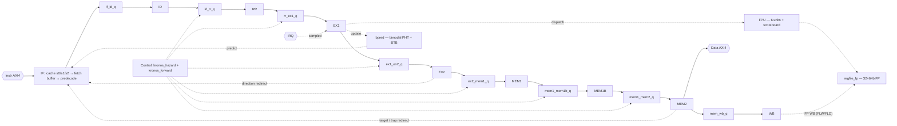
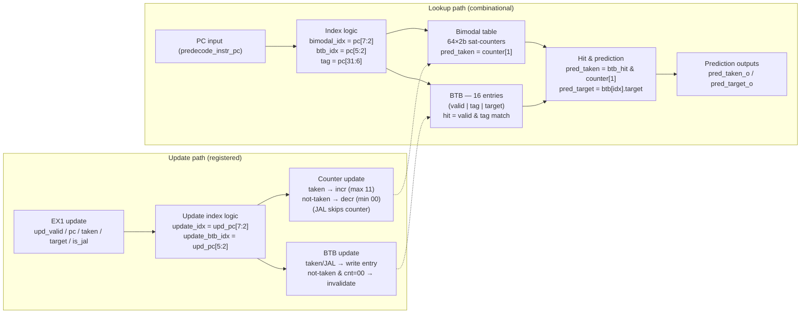
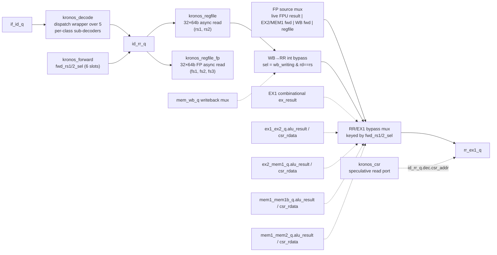
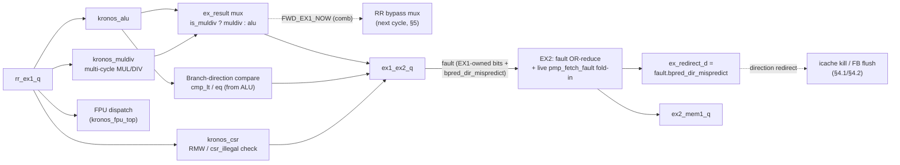
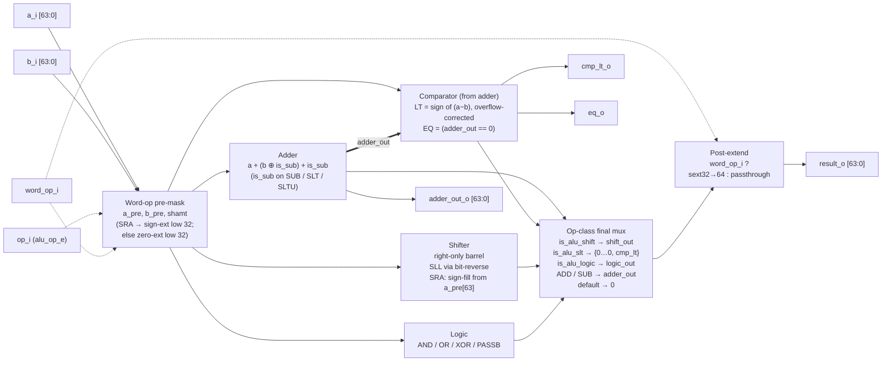
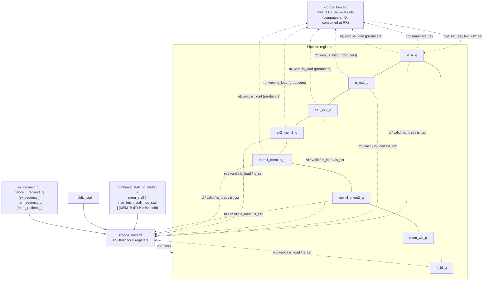
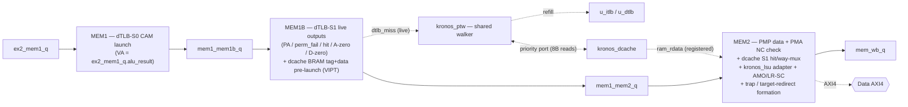
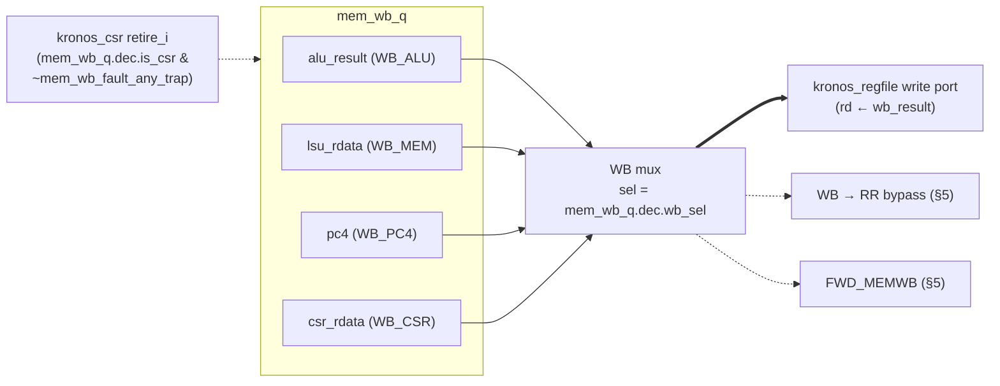
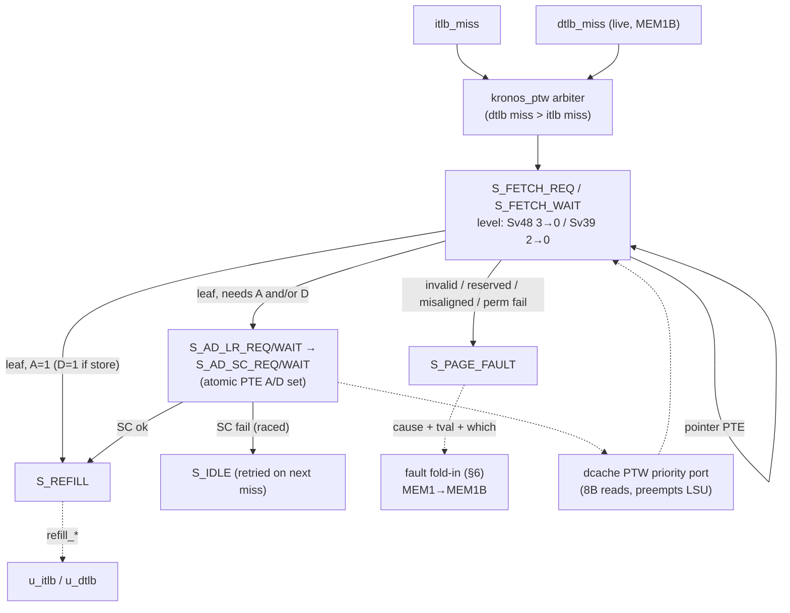

# kronos-riscv Architecture Reference

**ISA:** RV64IMAFDC &nbsp;|&nbsp; **Microarchitecture:** 9-stage in-order pipeline — register-read stage and split EX/MEM boundaries for the Fmax push, see §1 &nbsp;|&nbsp; **Bus:** AXI4 &nbsp;|&nbsp; **Branch prediction:** bimodal (64-entry PHT + 16-entry BTB)

kronos-riscv is a 9-stage in-order RISC-V processor implementing the RV64IMAFDC ISA. A BOOM-style frontend — a pipelined instruction cache, a fetch buffer, and a predecode block that also owns RVC decompression — feeds Instruction Decode (ID) and Register-Read (RR); RR performs the integer and FP register-file reads and the operand-bypass mux, so Execute consumes only flop outputs. Execute is split into EX1 (ALU/AGU, muldiv dispatch, branch-direction compare, CSR read-modify-write, FPU dispatch) and EX2 (fault aggregation and direction-mispredict redirect formation). Memory access is split into MEM1 (dTLB lookup start), MEM1B (the dTLB's internal encode sub-stage, where the translated PA and perm-fail/miss/A/D-bit outputs become live), and MEM2 (data-side PMP check, dcache hit/data, target-mispredict and trap redirect formation), followed by Writeback (WB). Every fault source — illegal instruction, ECALL/EBREAK, CSR/privilege failures, PMP, page faults, trigger hits — writes exactly one bit into a `fault_t` struct that is registered one stage past its producer; the two redirect points (EX2 for direction mispredicts, MEM2 for everything else) OR-reduce only registered bits, so no fault ever reaches a consumer combinationally. A separate FPU with six pipelined units handles the F and D extensions and dispatches from EX1; a writeback-slot scoreboard, not the integer forwarding network, arbitrates its shared result port. `kronos_hazard` and `kronos_forward` sit outside the pipeline stages and manage stalls, flushes, and a six-producer-slot operand-forwarding network.



The nine pipeline registers — `if_id_q`, `id_rr_q`, `rr_ex1_q`, `ex1_ex2_q`, `ex2_mem1_q`, `mem1_mem1b_q`, `mem1_mem2_q`, `mem_wb_q` — carry decoded instruction state across stages. Names follow a `{producer stage}_{consumer stage}` convention, with one quirk worth knowing when reading the RTL: the MEM1B→MEM2 register is `mem1_mem2_q`, not `mem1b_mem2_q` — MEM1B is the dTLB's internal S1 (encode) sub-stage rather than a distinct producer name, and its register type comment describes it as "passed through MEM1B→MEM2 with PMP/PMA bits filled in." Each register has an `en` enable and a `flush` (clear-to-NOP) control driven by `kronos_hazard`. Operand forwarding is handled by `kronos_forward`, which selects among six producer slots — `FWD_EX1_NOW`, `FWD_EX1`, `FWD_EXMEM`, `FWD_MEM1B`, `FWD_MEM2`, `FWD_MEMWB` — consumed by the bypass mux at the RR stage; see §5 for the full source map. FP operand hazards are managed by `kronos_fpu_scoreboard` rather than the integer forwarding network (§8 covers what that scoreboard actually arbitrates).

---

## 1. Design Evolution

One row per stage. AXI4 and bimodal branch prediction were established in Stage 3 and remain unchanged; the pipeline's stage count and register boundaries were restructured by the Stage 7 Fmax push (7a–7e) — see the diagram above for the current 9-stage shape.

| Stage | ISA | Key modules introduced | Key concept |
|-------|-----|----------------------|-------------|
| 0 | RV32I | `kronos_decode`, `kronos_regfile`, `kronos_alu`, `kronos_lsu` (OBI), `kronos_csr` | Single-cycle golden model |
| 1 | RV32I | `kronos_lsu` (OBI FSM), `kronos_forward`, `kronos_hazard` | 5-stage pipeline, data/control hazards |
| 2 | RV32IM | `kronos_muldiv` | Multi-cycle stall protocol |
| 3 | RV32IMC | `kronos_lsu` (AXI4), `kronos_decompress`, `kronos_align`, `kronos_bpred` | Native AXI4, C extension, branch prediction |
| 4 | RV64IMAC | `kronos_alu` (64-bit), `kronos_muldiv` (64-bit), `kronos_decompress` (RV64C), `kronos_lsu` (LR/SC + AMO), `kronos_csr` (64-bit) | 64-bit datapath widening, atomic operations |
| 5a | RV64IMAFD | `kronos_regfile_fp`, `kronos_fpu_top`, `kronos_fpu_scoreboard`, `kronos_fpu_fmisc`, `kronos_fpu_fcvt`, `kronos_fpu_fadd`, `kronos_fpu_fmul`, `kronos_fpu_fma` | Separate FP register file, multi-unit FPU dispatch, scoreboard hazard model |
| 5b | RV64IMAFDC | `kronos_fpu_iter`, `kronos_fpu_fdiv_core`, `kronos_fpu_fsqrt_core` | Iterative FDIV/FSQRT (radix-2 SRT) |
| 5c–5h | RV64IMAFDC | `kronos_icache`, `kronos_dcache`, `kronos_trigger` | Performance counters, CRV harness, I/D caches (4-way + tree-PLRU), FENCE.I, debug/trace layer |
| 6a–6c | RV64IMAFDC | `kronos_pmp`, `kronos_tlb`, `kronos_ptw` | M/S/U privileged modes + trap delegation + PMP, Sv39/Sv48 MMU + iTLB/dTLB + HW PTW + sfence.vma, closeout |
| 6d–6i | RV64IMAFDC | `kronos_ram` (SDP wrapper); `kronos_decode_int`/`_mem`/`_ctrl`/`_sys`/`_fp` (per-class decoder split, replacing the monolithic `kronos_decode`); `kronos_predecode` + `kronos_fetch_buffer` (BOOM-style frontend rewrite, replacing `kronos_align`) | RAM wrapper infrastructure, PMA non-cacheable regions, dcache `data_q` BRAM-back, per-class decoder split, BOOM-style frontend rewrite, cache tag arrays + FP regfile in BRAM/LUTRAM, verification overhaul |
| 7a–7c | RV64IMAFDC | (no new modules — restructures `kronos_top`, `kronos_forward`, `kronos_hazard`, `kronos_csr`) | In-order Fmax push: BOOM-style fault-bit propagation (`fault_t`) + EX1/EX2 split; RR (register-read) stage + bypass network rebuild; MEM1/MEM2 split (dTLB/PMP separated from dcache hit) |
| 7d | RV64IMAFDC | (no new modules) | MEM1B pipeline-register split + PMP retime + `FWD_MEM2` load suppression + `trap_vector` retime; post-route WNS −3.128 → −2.872 ns on KV260 (xck26-2LV, Vivado 2025.2). RTL portion complete; Pblock floorplan deferred. |
| 7e | RV64IMAFDC | (no new modules) | dTLB internal S0/S1 pipeline split (landed); stall-network retime — registering `event_bus` ahead of the `mhpmcounter` clock-enable fan-in — still open |

---

## 2. Module Hierarchy

Full instantiation tree for `kronos_top`. Modules under `rtl/common/` are shared verbatim across stages; modules under `rtl/stage7/` are the current stage's active copy. See §1 for a module's introduction stage.

```
kronos_top  (rtl/stage7/kronos_top.sv)
├── u_icache        kronos_icache            (rtl/stage7/kronos_icache.sv)             s0/s1/s2 pipeline, per-stage kill inputs
├── u_fb            kronos_fetch_buffer      (rtl/common/kronos_fetch_buffer.sv)       depth-4 FIFO, icache S2 → predecode
├── u_predecode     kronos_predecode         (rtl/common/kronos_predecode.sv)          replaces kronos_align
│   ├── u_decomp_lower  kronos_decompress    (rtl/common/kronos_decompress.sv)         lower-half RVC expand
│   └── u_decomp_upper  kronos_decompress    (rtl/common/kronos_decompress.sv)         upper-half RVC expand
├── u_bpred         kronos_bpred             (rtl/common/kronos_bpred.sv)              reused unmodified (see §1)
├── u_decode        kronos_decode            (rtl/stage7/kronos_decode.sv)             dispatch wrapper over 5 sub-decoders
│   ├── u_int       kronos_decode_int        (rtl/stage7/kronos_decode_int.sv)         OP / OP-IMM / OP-IMM-32 / OP-32 / LUI / AUIPC
│   ├── u_ctrl      kronos_decode_ctrl       (rtl/stage7/kronos_decode_ctrl.sv)        JAL / JALR / BRANCH
│   ├── u_mem       kronos_decode_mem        (rtl/stage7/kronos_decode_mem.sv)         LOAD / STORE / LOAD-FP / STORE-FP / AMO
│   ├── u_sys       kronos_decode_sys        (rtl/stage7/kronos_decode_sys.sv)         SYSTEM: priv/sfence cluster + CSR*
│   └── u_fp        kronos_decode_fp         (rtl/stage7/kronos_decode_fp.sv)          OP-FP + the four FMA opcodes
├── u_regfile       kronos_regfile           (rtl/stage0/kronos_regfile.sv)            reused unmodified (see §1); 2R read now issued from RR
├── u_regfile_fp    kronos_regfile_fp        (rtl/common/kronos_regfile_fp.sv)         3R read now issued from RR
├── u_forward       kronos_forward           (rtl/stage7/kronos_forward.sv)            6-slot bypass select, computed at ID
├── u_hazard        kronos_hazard            (rtl/stage7/kronos_hazard.sv)             en/flush for 8 registers, stall priority
├── u_alu           kronos_alu               (rtl/common/kronos_alu.sv)                EX1
├── u_muldiv        kronos_muldiv            (rtl/common/kronos_muldiv.sv)             EX1, multi-cycle MUL/DIV
├── u_csr           kronos_csr               (rtl/stage7/kronos_csr.sv)                RR speculative read + EX1 RMW + WB-retire commit
├── u_trigger       kronos_trigger           (rtl/common/kronos_trigger.sv)             Sdtrig hardware breakpoints
├── u_pmp_fetch     kronos_pmp               (rtl/stage7/kronos_pmp.sv)                16 regions, instruction side
├── u_pmp_data      kronos_pmp               (rtl/stage7/kronos_pmp.sv)                16 regions, data side
├── u_itlb          kronos_tlb               (rtl/stage7/kronos_tlb.sv)                8-entry CAM, instruction side
├── u_dtlb          kronos_tlb               (rtl/stage7/kronos_tlb.sv)                8-entry CAM, data side; internal S0/S1 split (see §1)
├── u_ptw           kronos_ptw               (rtl/stage7/kronos_ptw.sv)                Sv39/Sv48 hardware page-table walker
├── u_lsu           kronos_lsu               (rtl/stage7/kronos_lsu.sv)                thin MEM2 adapter to kronos_dcache
├── u_dcache        kronos_dcache            (rtl/stage7/kronos_dcache.sv)             AXI master, AMO arithmetic, LR/SC reservation
└── u_fpu           kronos_fpu_top           (rtl/common/fpu/kronos_fpu_top.sv)        dispatches from EX1
    ├── u_fmisc     kronos_fpu_fmisc         1-cycle: FSGNJ/FMIN/FMAX/FCLASS/CMP/FMV
    ├── u_fcvt      kronos_fpu_fcvt          3-cycle: FCVT
    ├── u_fadd      kronos_fpu_fadd          7-cycle: FADD/FSUB
    ├── u_fmul      kronos_fpu_fmul          9-cycle: FMUL
    ├── u_fma       kronos_fpu_fma           9-cycle: FMADD/FMSUB/FNMADD/FNMSUB
    ├── u_iter      kronos_fpu_iter          variable: FDIV/FSQRT wrapper FSM
    │   ├── u_fdiv  kronos_fpu_fdiv_core     radix-2 SRT division
    │   └── u_fsqrt kronos_fpu_fsqrt_core   radix-2 SRT square root
    └── u_scoreboard kronos_fpu_scoreboard   writeback-slot reservation (see §8.1 — not a per-register busy table)
```

---

## 3. Memory Subsystem

Cache and register-file storage that maps to BRAM/LUTRAM goes through `rtl/common/kronos_ram.sv`, a parameterised SDP RAM wrapper with two backends behind the `KRONOS_RAM_FPGA` define:

- **FPGA backend** — `xpm_memory_sdpram` (Xilinx Parameterized Macros). Vivado infers RAMB36/RAMB18 deterministically. Read latency is 1 cycle; same-cycle write+read collision returns the OLD value (`WRITE_MODE_B = "no_change"` — RAMB36/RAMB18 SDP only supports `"no_change"` / `"read_first"` on port B).
- **ASIC / Verilator default** — behavioural SDP that synthesises as flops on tools without XPM. Same 1-cycle read, same byte-write semantics. Marked as a stub for vendor SRAM-compiler replacement at tape-out.

Consumers handle same-cycle write→read forwarding externally:

| Consumer | Wrapper instances | Per-instance geometry | Bypass strategy |
|---|---|---|---|
| `kronos_icache` data | 4 (one per way) | `64 sets × 16 words × 32 b` | refill→read 1-deep prev-write bypass |
| `kronos_icache` tag  | 4 | `64 sets × 56 b` (tag zero-padded to 8 b multiple) | refill→read 1-deep prev-tag-write bypass + S1→S2 tag holdover |
| `kronos_dcache` data | 4 | `64 sets × 8 beats × 64 b` | store-hit / last-refill-beat / load 1-deep prev-write bypass |
| `kronos_dcache` tag  | 4 | `64 sets × 56 b` | refill→read 1-deep prev-tag-write bypass |

Smaller storage stays in flops or LUTRAM — iTLB/dTLB CAMs (8 entries each), branch predictor PHT/BTB (64+16 entries), integer regfile (`rtl/stage0/kronos_regfile.sv`, LUTRAM), FP regfile (`rtl/common/kronos_regfile_fp.sv`, LUTRAM). The wrapper is not used for these because their geometry (CAMs, very small register banks) does not match BRAM SDP.

---

## 4. Frontend — Instruction Cache, Fetch Buffer, Predecode, Branch Prediction

The frontend follows a BOOM-style structure: a pipelined instruction cache with per-stage kill inputs, a standalone fetch buffer that decouples the cache from decode-side back-pressure, and a predecode block that both expands compressed instructions and tracks halfword spanning. It replaced a single per-instruction fetch FSM plus a combined alignment/decompression FSM (`kronos_align`); §4.5 points at that history.

### 4.1 Instruction Cache — `kronos_icache`

16 KB, 4-way set-associative, 64-byte lines, tree-PLRU replacement (64 sets, 3 PLRU bits/set), critical-word-first refill via an 8-beat AXI4 WRAP burst. Data arrays are 4× `kronos_ram` (one per way); tag/valid/PLRU stay in flops.

The cache is structurally split into three stages, each with its own `valid` register and a combinational kill input:

| Stage | Registers | Action |
|---|---|---|
| S0 | (combinational) | `s0_addr_i` / `s0_pc_i` presented; latched into S1 on `s0_ready_o & s0_valid_i`. |
| S1 | `s1_valid_q` | BRAM read in flight. Cleared by `s1_kill_i`. |
| S2 | `s2_valid_q`, `s2_hit_q` | Combinational hit detect against the tag array; a hit pushes `(pc, data)` into the fetch buffer. Cleared by `s2_kill_i`. |

`s1_kill_i` and `s2_kill_i` are driven combinationally from `redirect_load | fence_i_pulse` — where `redirect_load = mem_redirect_q | ex_redirect_q | fence_i_redirect_q | pred_taken_q` is the same signal that reloads `s0_pc_q`. Note that `redirect_load` includes `pred_taken_q`, a *speculative* predicted-taken kill, not only the three confirmed (direction/trap/FENCE.I) redirects — a killed S2 entry with a real miss does not start a refill, so wrong-path fetches never issue AXI traffic, whether the kill was speculative or confirmed. A separate, narrower `confirmed_redirect_i` (only `ex_redirect_q | mem_redirect_q` — excludes both `pred_taken_q` and `fence_i_redirect_q`) lets an in-flight refill mark itself squashed without discarding a line that a since-corrected prediction may still want.

When the fetch buffer is full, S2 stalls (does not advance, does not kill) and back-pressure propagates to S1 and `s0_ready_o` — ordinary valid/ready flow control, not a shared stall signal with the rest of the pipeline.


### 4.2 Fetch Buffer — `kronos_fetch_buffer`

A depth-4 FIFO between icache S2 and predecode. Each entry carries `(pc, instr_word, valid)` — the PC travels with the data, so predecode never has to reconstruct which address a word came from. `enq_ready_o = (count < DEPTH)`, `deq_valid_o = (count > 0)`; a single `flush_i` (driven by the same redirect signals as the icache kills, OR'd with the FENCE.I pulse) clears the FIFO in one cycle so stale entries fetched ahead of a redirect or a self-modifying-code drain cannot reach decode.

### 4.3 Predecode — `kronos_predecode`

Replaces `kronos_align`. Consumes one 4-byte-aligned word at a time from the fetch-buffer head and emits at most one instruction per cycle. Decompression is internal: two combinational `kronos_decompress` instances (`u_decomp_lower`, `u_decomp_upper`) expand whichever half the classifier selects — there is no separate top-level decompress stage.

State is two registers: `prev_half_q` (the lower 16 bits of a 32-bit instruction whose halves span two fetch-buffer entries) and `word_lower_consumed_q` (set when the lower 16 bits of the current head have been emitted as RVC but the upper 16 bits are still pending in the same word). The classifier's five cases:

| Case | Condition | Emits | FB pop |
|---|---|---|---|
| Combine span | `prev_half_valid_q` set | `{word[15:0], prev_half}` as a 32-bit instr at `prev_half_pc_q` | no (re-reads the same head from its upper half next cycle) |
| RVC at lower | not spanning, reading lower half, `word[1:0] ≠ 11` | decompressed 16-bit instr | no (upper half still pending) |
| 32-bit non-spanning | not spanning, reading lower half, `word[1:0] = 11` | `word_data_i` unchanged | yes |
| RVC at upper | not spanning, reading upper half, `word[17:16] ≠ 11` | decompressed 16-bit instr at `word_pc \| 2` | yes |
| Span lower | not spanning, reading upper half, `word[17:16] = 11` | (no emit — buffers `word[31:16]` into `prev_half_q`) | yes |

Backpressure is strict valid/ready: while `instr_valid_o & ~instr_ready_i`, no internal state advances and the fetch-buffer head is not popped — the same `(instr, pc)` is re-presented until the consumer accepts it. A redirect's `flush_i` clears `prev_half_q` and `word_lower_consumed_q` in the same cycle; `flush_pc_offset_i` (the redirect target's `pc[1]`) primes `word_lower_consumed_q` so a half-aligned redirect target starts from the correct half. Cross-page fault detection (`pc[11:1] == 11'h7FF` on a 32-bit instruction's lower half) is unchanged from the pre-rewrite alignment unit, gated by `translate_fetch_i`.

`instr_fetch_stall` (consumed by `kronos_hazard`, §7) is simply `~align_instr_valid & ~pmp_fetch_fault & ~redirect_load` — decode-side stalls (`mem_stall`, `muldiv_stall`, `fpu_stall`) hold `if_id_en` low and back-pressure through predecode's `instr_ready_i`; they never reach into the icache or fetch buffer directly.

### 4.4 Branch Predictor — `kronos_bpred`

The branch predictor combines a **bimodal pattern history table (PHT)** with a **branch target buffer (BTB)**; its structure has not changed since it was introduced (see §1).

- **PHT:** 64 entries indexed by `PC[7:2]`, each holding a 2-bit saturating counter (00 = strongly not-taken, 11 = strongly taken).
- **BTB:** 16 entries indexed by `PC[5:2]`, each holding a valid bit, a tag (`PC[31:6]`), and a 64-bit target address. Direct-mapped; a hit requires `valid && tag match`.



Reset initializes every counter to `2'b01` (weakly not-taken) and clears the BTB.

**Lookup (combinational):** Every cycle, `predecode_instr_pc` (predecode's emitted PC, not a dedicated fetch-address register) indexes both structures simultaneously. If the BTB entry is valid and the PHT counter MSB is `1`, the predictor asserts `pred_taken` and drives `pred_target` from the BTB; the frontend uses `pred_target` as the redirect target instead of `PC+2/4`. The predicted-taken redirect is registered (`pred_taken_q`) before it reaches the icache kill / fetch-buffer flush network, so the branch itself is already captured into `if_id_q` by the time the redirect fires — at most one extra wrong-path bubble per predicted-taken branch.

**Update (registered):** EX1 sends the resolved direction and target back to the predictor, keyed by `rr_ex1_q.pc` (the branch's own PC, one register earlier than its EX2 fault-aggregation point). The PHT counter increments on taken, decrements on not-taken, saturating at the extremes. A taken outcome writes the BTB with the resolved target; a not-taken outcome where the counter has saturated to `00` invalidates the BTB entry.

**Misprediction detection.** A *direction* mispredict — the predicted taken/not-taken outcome disagrees with EX1's resolved outcome — is detected at EX1/EX2 and forms `ex_redirect` (§6). A *target* mispredict — both sides agree the branch was taken but the predicted target differs from the resolved target — is deferred to MEM2 (`bpred_mispredict_target`, §6), specifically so the JALR target adder and the 32-bit target comparator are removed from the direction-redirect's combinational path.


### 4.5 History: the pre-icache fetch model

The frontend above replaced two earlier designs (see §1 for when). Fetch was originally a two-state per-instruction AXI FSM (`FETCH_IDLE`/`FETCH_WAIT_R`) issuing one AR transaction per word, and alignment/decompression was a single four-state FSM (`NORMAL`/`BUFFERED`/`NEED_UPPER`/`SKIP_LOWER`) consuming that word combinationally. A cache first replaced the per-word fetch FSM; later, two attempts at bolting a fetch buffer onto the still-combinational alignment FSM proved unsound — a buffered head sitting one cycle behind an FSM that reads combinationally cannot be flushed atomically on a redirect — which is why the full BOOM-style split into icache S0/S1/S2 + fetch buffer + predecode (this section) replaced the alignment FSM outright rather than wrapping it. See `docs/superpowers/specs/2026-04-26-icache-design.md` (the original per-word-FSM replacement) and `docs/superpowers/specs/2026-05-02-stage6f-icache-boom-frontend-v3-design.md` (the full frontend rewrite and the failure analysis of the two intermediate attempts) for the retired designs in full.

---

## 5. ID / RR — Decode and Register Read



`kronos_decode` is a thin combinational dispatch wrapper over five per-class sub-decoders — `kronos_decode_int` (OP/OP-IMM/OP-IMM-32/OP-32/LUI/AUIPC), `kronos_decode_ctrl` (JAL/JALR/BRANCH), `kronos_decode_mem` (LOAD/STORE/LOAD-FP/STORE-FP/AMO), `kronos_decode_sys` (the SYSTEM priv/sfence cluster and CSR\*), and `kronos_decode_fp` (OP-FP and the four FMA opcodes, the only sub-decoder that reads `frm_i`). Each sub-decoder owns its class's `funct3`/`funct7` decode and per-class illegal-encoding check; the wrapper matches on `opcode[6:0]`, routes exactly one sub-decoder's `decoded_instr_t` bundle to its output, and raises `illegal_insn_o` itself only when no class matches. The external interface (`instr_i`, `frm_i`, `decoded_o`, `illegal_insn_o`) is unchanged from the pre-split monolithic decoder, so nothing downstream of ID sees a difference.

ID also generates the fault bits it owns — `ecall`, `ebreak`, `illegal`, `is_mret`, `is_sret` — directly into `id_rr_q.fault`, and computes `fwd_rs1_sel`/`fwd_rs2_sel` via `kronos_forward` (below) for capture into the same register. ID performs **no** register-file read, no bypass mux, and no CSR access — those all moved to RR so that EX1's ALU/AGU/FPU-dispatch/branch-compare/CSR-illegal logic starts from pure flop outputs (§6).

**RR — register read and bypass.** `kronos_regfile` (32×64b, async read, sync write, `x0` reads-as-zero/writes-ignored) and `kronos_regfile_fp` (32×64b, three async read ports `fs1`/`fs2`/`fs3`, one write port `fd`) are both read from `id_rr_q.dec.rs1/rs2/rs3` at RR, one cycle later than the pre-7b design read them at ID. `kronos_csr` also gets a second, RR-only combinational read port (`rr_csr_addr_i`/`rr_csr_read_en_i`/`rr_csr_rdata_o`) driven from `id_rr_q.dec.csr_addr`, separate from the CSR read-modify-write that still executes at EX1 from `rr_ex1_q` — RR's CSR read is purely speculative, captured into `rr_ex1_q.csr_rdata` and safe to discard if the consumer is later flushed.

**Integer bypass.** `int_rs1_data_rr` picks `mem_wb_q`'s writeback result over the (possibly stale) `kronos_regfile` read when `mem_wb_q` is writing the same register this cycle — this is the WB→RR analogue of the old WB→ID bypass, shifted one register later.

**FP bypass.** A four-way mux, mirroring the integer path, picks between a live-just-completed FPU result (`fp_result_avail` and a tag match against `id_rr_q.dec.rs1/rs2/rs3`), a still-draining FP-arithmetic producer sitting in `ex2_mem1_q` (`ex2_mem1_q.dec.is_fp & rd_fp & ~fp_load` — FP loads are excluded since their value isn't in `.alu_result` at that point), the FP writeback value (`fp_we`/`fp_wa` match), or a plain `kronos_regfile_fp` read. This exists specifically for the single instruction that was held in IF/ID for the duration of an `fpu_stall`: when the stall lifts, that instruction reaches RR the same cycle its producer's result becomes visible, and this mux picks it up instead of a stale regfile read. It is **not** a general multi-cycle FP forwarding network — see §8.1 for why the FPU's blocking dispatch model means at most one FP consumer can ever be waiting.

**RR/EX1 bypass mux.** The final operand values captured into `rr_ex1_q.rs1_data`/`rs2_data` are selected by `id_rr_q.fwd_rs1_sel`/`fwd_rs2_sel` — computed at the preceding ID cycle by `kronos_forward` from the instruction that will occupy RR at the *next* cycle — over six sources, freshest first:

| Select | Source | Producer's stage at select time | Notes |
|---|---|---|---|
| `FWD_EX1_NOW` | `ex_result` (combinational EX1 ALU/muldiv output) | RR (advancing to EX1 next cycle) | same-cycle bypass; no extra stall for back-to-back ALU-RAW pairs |
| `FWD_EX1` | `ex1_ex2_q.alu_result` (or `.csr_rdata` if CSR-typed) | EX1 | |
| `FWD_EXMEM` | `ex2_mem1_q.alu_result` (or `.csr_rdata`) | EX2 | legacy enum name; the source register is `ex2_mem1_q` |
| `FWD_MEM1B` | `mem1_mem1b_q.alu_result` (or `.csr_rdata`) | MEM1 | |
| `FWD_MEM2` | `mem1_mem2_q.alu_result` (or `.csr_rdata`) | MEM1B | ALU/CSR producers only — `kronos_forward` suppresses this slot for loads, so the live `lsu_rdata` path never reaches the bypass mux |
| `FWD_MEMWB` | `wb_result_64` (the WB mux output, driven from `mem_wb_q`) | MEM2 | the only path that carries a registered **load** value — every load producer in an earlier slot falls through to here |
| (default) | RR-cycle source (the FP mux above, or the integer regfile/WB-bypass mux) | — | no producer matched |

`kronos_forward` computes this per rs1/rs2 from the consumer's `if_id_rs1/rs2` addresses against all six producer slots, checked in the same freshest-first order as the table above. Five of the six slots (`id_rr_q`, `rr_ex1_q`, `ex1_ex2_q`, `ex2_mem1_q`, `mem1_mem1b_q`) have their own `valid` input port; the last, `mem1_mem2_q` (which can only resolve to `FWD_MEMWB`), does not — its valid gate is folded into `rd_wen_i` at the instantiation site instead (`.mem1_mem2_rd_wen_i (mem1_mem2_q.dec.rd_wen & mem1_mem2_q.valid)`). `rd = x0` and FP-destination producers (`rd_fp`) never match an integer consumer; loads are suppressed on every slot except the last one — `FWD_MEM2` also suppresses loads (per the note above), so `FWD_MEMWB` is the only slot that ever carries a load value.

---

## 6. EX1 / EX2 — Execute, Branch Resolution, Muldiv, Fault Aggregation



EX1 consumes only `rr_ex1_q` flop outputs — no combinational reach into the register file, the bypass mux, or the CSR file remains in front of the ALU, the AGU, FPU dispatch, or the branch comparator, which is the entire point of moving register read into RR (§5). EX2 aggregates fault bits and forms the direction-mispredict redirect; it performs no new datapath computation.

**ALU (`kronos_alu`, unchanged since its structural decomposition was introduced — see §1).** Single-cycle, fully combinational. BOOM/Rocket-style structural decomposition: one shared 64-bit adder (drives ADD, SUB, SLT, SLTU and the comparator), one right-only barrel shifter (SLL is implemented as input bit-reverse → right-shift → output bit-reverse, sharing the same shifter as SRL/SRA), one logic block (AND, OR, XOR, PASSB), and a 5:1 op-class final mux; ADD/SUB get an explicit arm and the default arm produces zero so an invalid `alu_op` cannot leak adder output into writeback. W-suffix instructions run on the same 64-bit datapath via input pre-mask and output sign-extension — no parallel 32-bit datapath. `alu_a` selects between the forwarded RS1 value and `rr_ex1_q.pc` (AUIPC / branch offset); `alu_b` selects between the forwarded RS2 value and the sign-extended immediate. In addition to `result_o`, the ALU exposes `adder_out_o`, `cmp_lt_o` (signed-or-unsigned LT per `op_i`), and `eq_o` (`adder_out == 0`, valid whenever the adder is in subtract mode) — the branch unit consumes `cmp_lt_o`/`eq_o` directly instead of duplicating the comparator.



**Muldiv (`kronos_muldiv`, EX1).** Implements all eight M-extension operations for 32-bit and 64-bit operands. MUL requires **2 cycles**. DIV/REM require **34 cycles** (32-bit) or **66 cycles** (64-bit) in the normal case; division by zero and `INT_MIN / -1` are detected early and resolve in **2 cycles**. `muldiv_stall` freezes the entire pipeline while asserted, but — unlike the older redirect-blind version — the hazard priority table (§7) lets a redirect flush a wrong-path MUL/DIV out from under `muldiv_stall` rather than waiting for it to finish.


**Branch resolution.** EX1 evaluates every branch condition from the ALU's `cmp_lt_o`/`eq_o` — `kronos_decode` drives `alu_op` to `ALU_SLT` (BLT/BGE) or `ALU_SLTU` (BLTU/BGEU, and BEQ/BNE, where any subtract-style op makes `eq_o` valid) — and maps `funct3` to `alu_eq` / `~alu_eq` / `alu_cmp_lt` / `~alu_cmp_lt`. JAL, JALR, and taken branches compute `ex_pc_d` (the redirect target on a direction mispredict) from `rr_ex1_q.pc + imm` or the JALR adder (`fwd_rs1_data + sext(imm)`, bit 0 cleared). The branch predictor's update inputs (§4.4) are driven from this same EX1 state, keyed by `rr_ex1_q.pc`.

**Fault-bit propagation.** Every fault and privileged-transition source writes exactly one bit of the `fault_t` struct, in the pipeline register belonging to the stage that produces it, with no combinational reach across module boundaries:

| Producer stage | `fault_t` bits |
|---|---|
| ID (`id_rr_q.fault`) | `ecall`, `ebreak`, `illegal`, `is_mret`, `is_sret` |
| EX1 (folded into `ex1_ex2_q.fault`) | `csr_illegal`, `mret_priv_fail`, `sret_priv_fail`, `satp_tvm_fail`, `wfi_priv_fail`, `irq_pending`, `bpred_dir_mispredict`, `trig_hit` |
| EX2 (folded into `ex2_mem1_q.fault`) | `pmp_fetch_fault` |
| MEM1→MEM1B (folded into `mem1_mem1b_q.fault`; passes through `mem1_mem2_q.fault` unchanged — MEM1B does not fold anything new in) | `instr_page_fault`, and the PTW-invalid-PTE arm of `load_page_fault`/`store_page_fault` (the walk completing with a bad PTE) |
| MEM2 (live wires, captured directly into `mem_wb_q.fault` at the MEM2→WB edge — these bypass `mem1_mem2_q.fault` entirely rather than folding into it) | `pmp_data_fault`, `ex_amo_nc_fault`, the dTLB-perm-fail arm of `load_page_fault`/`store_page_fault` (from the registered `mem1_mem2_q.dtlb_perm_fail`), `bpred_target_mispredict`, `dcache_bus_err_fault` |

Each pipeline register's `always_ff` carries forward every earlier producer's bits verbatim and OR-folds in only its own stage's new bits — a Verilator `UNUSEDSIGNAL` lint failure catches any bit a producer forgets to drive. Redirect formation reads only registered bits (plus the live MEM2 wires above, which stay within MEM2's own narrow cone), at exactly two points:

- **`ex_redirect_d = ex1_ex2_q.fault.bpred_dir_mispredict`** — formed at EX2, the only fault class resolved that early. A direction mispredict flushes every younger register — `if_id_q`, `id_rr_q`, `rr_ex1_q`, and `ex1_ex2_q` itself (the wrong-path follower that would otherwise land in `ex1_ex2_q` the same edge) — while the mispredicting branch, already past the EX1/EX2 boundary, continues to retire normally.
- **`mem_redirect_d`** — a single OR over every other fault bit in `mem1_mem2_q.fault` plus the still-live MEM2-cycle producers (`mem2_pmp_data_fault`, `mem2_amo_nc_fault`, `mem2_load_page_fault`, `mem2_store_page_fault`, `bpred_mispredict_target`, `dcache_bus_err_fault`) — all of which stay within MEM2's own narrow cone rather than crossing a module boundary. A `mem_redirect` flushes `if_id_q` through `mem1_mem2_q`.

**Trap cause priority.** `mem_trap_cause_d` (and its EX1-cycle predictive twin `ex1_trap_cause`, which feeds `kronos_csr.trap_vector_o` so the redirect target already reflects `medeleg`/`mideleg` delegation) select the cause in fixed priority order, roughly: trigger hit > instruction/load/store page fault > instruction/data PMP fault (or AMO non-cacheable fault) > D-cache bus error > pending interrupt > illegal/CSR-illegal/priv-fail class > ECALL (M/S/U per current `priv_q`) > EBREAK (default). MEM-class (older-instruction) faults always outrank EX1-class faults in the predictive path, since a MEM-class trap's `mem_redirect` would flush the EX1 instruction anyway.

**CSR unit (`kronos_csr`).** Two access points, not one: RR issues a purely speculative combinational read (§5) into `rr_ex1_q.csr_rdata`, discarded harmlessly if the consumer is later flushed; the actual CSRRW/CSRRS/CSRRC read-modify-write (plus immediate variants) executes at EX1 from `rr_ex1_q.dec.csr_addr`/`rs1_data`, gated only by `rr_ex1_q.valid & rr_ex1_q.dec.is_csr` — no `~combined_stall` gate, which is what breaks a historical `combined_stall → csr_illegal → ex_redirect → combined_stall` combinational loop. The CSR write itself does not commit at EX1: it retires from `mem_wb_q` (`retire_i = mem_wb_q.valid & mem_wb_q.dec.is_csr & ~mem_wb_fault_any_trap & ~combined_stall`), alongside `trap_i`/`mret_i`/`sret_i`, all driven from the registered `mem_wb_q.fault` bits. MISA reports I, M, A, F, D, C (MXL = 2); FCSR/FFLAGS/FRM are readable/writable, with the FPU's accumulated exception flags folded into `fcsr` at the same retire edge (gated by `mem_wb_is_fp_arith_q` so a non-FP retire cannot OR in a stale `fflags` value); `mstatus.FS` tracks FP state (Off/Initial/Clean/Dirty).

---

## 7. Hazard, Forwarding, and Stall Control



`kronos_forward` and `kronos_hazard` both sit outside the pipeline stages. `kronos_forward`'s bypass-source computation is covered in §5 — it is a pure combinational function of the consumer's `rs1`/`rs2` against all six producer slots, with loads suppressed on every slot except the last, `FWD_MEMWB`.

`kronos_hazard` drives `en` for the PC register plus all seven pipeline registers (8 `en` outputs total), and exposes 6 `flush` output ports (no `mem_wb_flush_o` exists) — but only 3 of those 6 (`if_id_flush_o`, `id_rr_flush_o`, `rr_ex1_flush_o`) are ever asserted by the module itself; the other 3 (`ex2_mem1_flush_o`, `mem1_mem1b_flush_o`, `mem1_mem2_flush_o`) are always-zero dead ports left unconnected at the instantiation, because `kronos_top` drives those three registers' actual flush conditions via separate combinational assigns (see priority 2 below). Fixed priority order (highest first):

| Priority | Condition | Effect |
|---|---|---|
| 1 | `mem_stall_i` (= `combined_stall_no_muldiv`: `mem_stall \| instr_fetch_stall \| fpu_stall \|` a MEM1B dTLB-miss hold) | Freeze all eight registers — no enables, no flushes. |
| 2 | `ex_redirect_i` (`ex_redirect_q \| fence_i_redirect_q`) or `mem_redirect_i` (`mem_redirect_q`) | Flush `if_id_q`, `id_rr_q`, `rr_ex1_q` (the registers `kronos_hazard` owns). `ex1_ex2_q`/`ex2_mem1_q`/`mem1_mem1b_q`/`mem1_mem2_q` flush via separate combinational assigns in `kronos_top`, gated on the same redirect signals, so the module boundary doesn't force every older register's flush condition through `kronos_hazard`'s port list. |
| 3a | ID-class RAW: `load_use \| fp_load_use \| csr_raw_stall_id \| jalr_fwd_stall \| frm_hazard` | Stall `pc`/`if_id`/`id_rr`; bubble into RR (`id_rr_flush`). |
| 3b | RR-class CSR-RAW: `csr_raw_stall_rr` | Stall `pc`/`if_id`/`id_rr`/`rr_ex1`; bubble into EX1 (`rr_ex1_flush`). Closes a one-cycle window where a consumer that has advanced from ID to RR would otherwise read a CSR write that is still in flight one register ahead. |
| 4 | `muldiv_stall_i` | Freeze all eight registers. Ranked *below* redirect so a wrong-path MUL/DIV can still be flushed instead of running to completion. |
| 5 (else) | — | Normal advance: all `en = 1`, no flushes. |

**Load-use.** A load can occupy any of six slots ahead of an ID-stage consumer — `id_rr_q`, `rr_ex1_q`, `ex1_ex2_q`, `ex2_mem1_q`, `mem1_mem1b_q`, or `mem1_mem2_q` — because the only registered load value is `mem_wb_q.alu_result` (`FWD_MEMWB`, §5): `FWD_MEM2` explicitly suppresses loads to keep the live `lsu_rdata` path out of the bypass mux. A load-use hazard therefore costs a full 5-cycle ID stall in the worst case (the load advances through all six slots before the consumer's `FWD_MEMWB` bypass fires at the next RR). `is_load` for this purpose mirrors `kronos_forward`'s `wb_sel == WB_MEM` predicate, so AMO and LR/SC — which also write `rd` from `lsu_rdata` at MEM2 — stall a dependent consumer exactly like an ordinary load; without this, a `bnez`/branch reading an SC's success/fail code the cycle after would see a stale regfile value. FP load-use (`fp_load_use`) is the same shape with FP consumer keys.

**JALR-forward stall.** A JALR in ID whose `rs1` matches a load producer in `ex2_mem1_q` or `mem1_mem1b_q` stalls rather than forwards — the load value isn't available until MEM2, too late for the JALR target adder. Non-load producers in those slots are covered by ordinary `FWD_EXMEM`/`FWD_MEM1B` forwarding without a stall.

**FRM/FCSR RAW.** A CSR write to FRM/FCSR sitting in EX1 (`rr_ex1_is_frm_write_i`) stalls an FP instruction in ID that reads the dynamic rounding mode (`rm = 3'b111`) for one cycle, so decode re-reads `frm` only after the write has landed.


---

## 8. FPU

The FPU handles all F and D extension instructions (`rtl/common/fpu/`, an unchanged file set since the iterative FDIV/FSQRT units were added — see §1: `kronos_fpu_top`, `kronos_fpu_scoreboard`, `kronos_fpu_fmisc`, `kronos_fpu_fcvt`, `kronos_fpu_fadd`, `kronos_fpu_fmul`, `kronos_fpu_fma`, `kronos_fpu_iter`, `kronos_fpu_fdiv_core`, `kronos_fpu_fsqrt_core`). It dispatches from EX1: `kronos_fpu_top` receives `rr_ex1_q`'s decoded FP operands whenever `is_fp` is asserted and routes them to one of six pipelined units. FP-destination results are written to `kronos_regfile_fp` through a dedicated writeback interface, bypassing the integer WB mux — but instructions with an **integer** destination that happen to dispatch through the FPU (FCVT.\*.S/D→int, FMV.X.W/D, FCLASS, FEQ, FLT, FLE) do the opposite: their result rides the ordinary integer `WB_ALU` path via `mem_wb_q.alu_result` (captured from `fpu_result` at the MEM2→WB edge), not the FP writeback interface.

### 8.1 Dispatch, Blocking Integration, and the Scoreboard

`kronos_fpu_scoreboard` is a **writeback-slot reservation shift register** (`DEPTH = 9`, the FMA/FMUL latency), not a per-FP-register busy table. Each dispatch computes which future cycle its result will complete (`dispatch_latency`, from the op's unit table below) and checks `slots_q[latency-1]` for a collision; the check is keyed by whether the result targets the FP regfile or the integer regfile (`fp_dest_i`/`int_dest_i`), which is what lets an FCVT/FMV/FCLASS/FEQ/FLT/FLE op (integer destination) share dispatch with an FP-destination op without a false collision. `busy_o` blocks a new dispatch on a real slot collision or while the iterative FDIV/FSQRT unit is already running.

That mechanism is built to let `kronos_fpu_top` accept a new dispatch every cycle whose writeback slot doesn't collide with an already-outstanding op — but `kronos_top`'s integration does not exploit this: `fp_inflight_q` is set on dispatch and only clears on `fpu_out_valid`, and `fpu_stall` (`= (fp_inflight_q | fpu_dispatching) & ~fp_result_avail`) freezes the **entire** integer pipeline for the whole duration, so only one FP operation is ever in flight from `kronos_top`'s perspective, regardless of the FPU's internal overlap capability. Because dispatch is fully serialized, at most one instruction — the one held in `if_id_q` for the length of the stall — can ever be waiting on a result; the RR-stage FP bypass mux described in §5 exists to hand that single consumer the result the same cycle the stall lifts, not to forward across a general multi-op pipeline. FP hazards (RAW and structural WB-port collisions) are therefore fully handled by blocking dispatch plus that single-slot bypass — there is no equivalent of the integer six-slot forwarding network for FP, and none is needed while dispatch stays serialized this way.

### 8.2 FPU Unit Table

| Unit | Module | Latency | Operations |
|------|--------|---------|------------|
| fmisc | `kronos_fpu_fmisc` | 1 cycle | FSGNJ, FMIN, FMAX, FCLASS, FEQ, FLT, FLE, FMV.X.W, FMV.W.X, FMV.X.D, FMV.D.X |
| fcvt | `kronos_fpu_fcvt` | 3 cycles | FCVT.W.S, FCVT.WU.S, FCVT.L.S, FCVT.LU.S, FCVT.S.W, FCVT.S.WU, FCVT.S.L, FCVT.S.LU, FCVT.S.D, FCVT.D.S, and D variants |
| fadd | `kronos_fpu_fadd` | 7 cycles | FADD.S, FSUB.S, FADD.D, FSUB.D |
| fmul | `kronos_fpu_fmul` | 9 cycles | FMUL.S, FMUL.D |
| fma | `kronos_fpu_fma` | 9 cycles | FMADD.S, FMSUB.S, FNMADD.S, FNMSUB.S, FMADD.D, FMSUB.D, FNMADD.D, FNMSUB.D |
| iter | `kronos_fpu_iter` | ≤ 29 (S) / ≤ 58 (D) cycles | FDIV.S, FDIV.D, FSQRT.S, FSQRT.D |

All units implement IEEE 754-2019 rounding and exception flag generation. The resolved rounding mode is carried from decode through the pipeline register (`rm_resolved`, resolved against `fcsr_frm` at decode time when the instruction encodes `rm = 3'b111`).

### 8.3 FDIV/FSQRT — Iterative SRT

`kronos_fpu_fdiv_core` and `kronos_fpu_fsqrt_core` implement radix-2 SRT iterative division and square root. One quotient/root bit is produced per cycle after an initial normalization step.

- Single precision (23-bit mantissa): ≤ 29 cycles
- Double precision (52-bit mantissa): ≤ 58 cycles

`kronos_fpu_iter` wraps both cores in a 3-state FSM: `IDLE → RUNNING → DONE`. While in RUNNING, `iter_busy_o` is asserted; the scoreboard's `busy_o` propagates this, freezing new dispatch (and, via `fpu_stall`, the whole integer pipeline) for the duration. Both cores handle special cases (±0, ±Inf, NaN, subnormals) combinationally before the iteration begins and short-circuit to DONE when applicable. The iterative unit reserves its writeback slot late (`late_req_i`/`late_latency_i = 1`, at ROUND time) since its total latency isn't known at dispatch.

---
## 9. MEM1 / MEM1B / MEM2 — Address Translation and the Data Cache



Address translation and the data cache occupy three of the pipeline's nine
stages. That split is not original design — it is the result of three
successive Fmax fixes (7c, 7d, 7e) chasing the same class of failure: a
combinational chain that starts at a `mem1_mem2_q`/`mem1_mem1b_q` flop,
crosses two or three module boundaries (dTLB → PMP → PTW → dcache → bypass
mux), and lands on another pipeline register's D-pin with no register in
between.

### 9.1 Why three stages

- **7c** split the original single MEM stage into MEM1/MEM2 to separate the
  dTLB lookup, the data-side PMP check, and the dcache BRAM-read launch from
  the dcache hit-detect/load-data-extension path — the chain that motivated
  it was `mem_wb_q.alu_result → muldiv → bpred → dtlb → dcache LUTRAM →
  CSR/PMP → dtlb → ptw → dcache LUTRAM → …`.
- **7d** found that even with MEM1/MEM2 separated, the PMP comparator itself
  was not flop-to-flop: `mem1_mem2_q.dtlb_pa → 16-region PMP CARRY8 chain
  (~12 levels) → pmp_data_fault (fanout 60) → CSR/PTW/dcache state → …  →
  rr_ex1_q.rs2_data` measured 35 logic levels and −5.088 ns WNS. The fix was
  structural: insert **MEM1B** as a dedicated stage whose only job is to run
  PMP/PMA/page-fault production on a registered PA and register the result
  before any consumer reads it.
- **7e** then found the *dTLB's own internals* were the next bottleneck —
  `ex2_mem1_q.alu_result → u_dtlb CAM+PLRU+hit_idx → live dTLB outputs
  (fanout 60+) → u_ptw FSM → u_dcache → bypass mux → rr_ex1_q.rs1_data`
  measured 19 logic levels / 7.374 ns. `kronos_tlb` itself was split
  internally into an S0 (CAM compare) / S1 (priority-encode + PA
  reconstruct + permission check) pair (§9.2, §11.4), and the dTLB's live
  `dtlb_miss`/`dtlb_a_zero`/`dtlb_d_zero`/`dtlb_hit` outputs were registered
  at the MEM1→MEM1B edge so the PTW kicks off from a flop rather than a live
  TLB-internal wire. Because the dTLB-S1 encode now takes the whole MEM1B
  cycle, PMP itself **moved a second time** — from MEM1B (7d's location) to
  MEM2 — since the translated PA isn't ready until MEM1B's end; MEM2 now
  runs the PMP comparator and the dcache tag-compare in parallel, with PMP
  the longer of the two paths.

`kronos_tlb` is a single physical module instantiated identically for both
`u_itlb` and `u_dtlb` (§11.4); only the dTLB instance's internal S0→S1 flop
happens to coincide with the top-level MEM1→MEM1B pipeline register, which
is why `mem1_mem2_reg_t`'s `dtlb_pa`/`dtlb_perm_fail`/etc. fields are
captured one edge *later* than `mem1_mem1b_reg_t` — the type comment in
`kronos_pkg.sv` calls this out explicitly ("dTLB outputs … are flop outputs
of the dTLB-S1 stage at the MEM1B edge, so they live in `mem1_mem2_reg_t`
… rather than `mem1_mem1b_reg_t`").

### 9.2 dTLB lookup and the PA hand-off

- **MEM1.** The dTLB-S0 lookup is issued combinationally against
  `ex2_mem1_q.alu_result` (the VA). A VA mux (`dtlb_lookup_va`) substitutes
  the held `mem1_mem1b_q.alu_result` instead whenever the MEM1B occupant is
  frozen on a live `dtlb_miss` — otherwise the PTW's own re-walk lookup
  would be silently overwritten by the next instruction advancing into MEM1
  the same cycle.
- **MEM1B.** The dTLB-S1 outputs (`lookup_hit_o`, `lookup_pa_o`,
  `lookup_perm_fail_o`, `lookup_a_zero_o`, `lookup_d_zero_o`) are live flop
  outputs of the dTLB's own internal register. `dtlb_miss` is computed here
  — `translate_data & mem1_mem1b_q.valid & (is_load|is_store|is_amo) &
  ((~hit & ~perm_fail) | a_zero | d_zero)` — and both freezes the pipeline
  (the MEM1B dTLB-miss arm of `combined_stall_no_muldiv`, §7) and kicks off
  `kronos_ptw`. A/D-bit re-walks fold into the same signal: an entry that
  hits with `A=0`, or a store that hits an entry with `D=0`, triggers a PTW
  walk that performs an atomic LR/SC on the leaf PTE to set the missing
  bit(s) (Svadu) before refilling the dTLB.
- **MEM1B→MEM2 edge.** `dtlb_pa`, `dtlb_perm_fail`, `dtlb_miss`,
  `dtlb_a_zero`, `dtlb_d_zero`, `dtlb_hit`, and `dtlb_was_hit` all capture
  into `mem1_mem2_q` for MEM2's PMP/PMA/page-fault checks and for the
  LSU's PA input.

See §11.4 for the dTLB/iTLB's internal S0/S1 mechanics, replacement policy,
and refill/flush behaviour, and §11.3 for the PTW that services a miss.

### 9.3 Data-side PMP and PMA

`u_pmp_data` is instantiated at MEM2 on `mem1_mem2_q.dtlb_pa`
(`kronos_top.sv:1254–1273`); §11.2 covers the shared region-matching logic
(also used by `u_pmp_fetch` on the instruction side). The PMA non-cacheable
region check (`mem2_addr_uncacheable`, against `MMIO_BASE` =
`0x4000_0000`–`0x4FFF_FFFF` by default) runs at MEM2 against the same PA;
an AMO/LR/SC that targets that region raises `mem2_amo_nc_fault` instead of
issuing a dcache transaction — the cache never sees an NC atomic. Page-fault
aggregation folds the registered `mem1_mem2_q.dtlb_perm_fail` bit into
`mem2_load_page_fault` / `mem2_store_page_fault`, keyed on
`is_load`/`is_store`/`is_amo`. All three (`mem2_pmp_data_fault`,
`mem2_amo_nc_fault`, `mem2_{load,store}_page_fault`) are live MEM2-cycle
wires that feed `mem_redirect_d` directly and capture into `mem_wb_q.fault`
at the MEM2→WB edge — the same bits §6's fault-bit table lists under "MEM2".

### 9.4 Data Cache — `kronos_dcache`

| Parameter | Value |
|---|---|
| Total size | 16 KB |
| Associativity | 4-way set-associative |
| Line size | 64 bytes (8 × 64-bit beats) |
| Sets | 64 |
| Replacement | Tree-PLRU (3 bits/set) |
| Write policy | Write-back, write-allocate |
| Refill | Critical-word-first via 8-beat AXI4 WRAP burst |
| Eviction | If victim dirty: 8-beat AXI4 INCR write burst |
| Hit latency | 1 cycle (registered), thanks to the MEM1B pre-launch |
| Non-cacheable bypass | Single-beat AXI4 (`DC_NC_AR/R/AW/W/B`) for the PMA region |

Per-way data and tag arrays are 4× `kronos_ram` each (§3), addressed
virtually-indexed/physically-tagged: the set+offset index (12 bits) is
within the page-offset width, so the index is alias-free under any
translation. The BRAM read is **pre-launched from MEM1B**
(`dcache_early_req_valid`/`dcache_early_addr`, keyed on
`mem1_mem1b_q.alu_result`) so `ram_rdata` is already a registered
MEM1B→MEM2 flop output by the time MEM2 needs it — this is what gives the
cache its 1-cycle hit latency inside a 3-stage MEM without adding a BRAM
read cycle of its own; the LSU's same-cycle hit response depends on it.

A dedicated **PTW priority port** (`ptw_req_valid_i` et al.) preempts the
LSU's own request whenever the walker needs a PTE fetch or an A/D-bit
LR/SC — single-port arbitration is safe because the pipeline is already
stalled on the very miss that triggered the walk, so the LSU never
contends with an in-flight walk.

**Two RAW-bypass tiers.** Xilinx SDP BRAM (`WRITE_MODE_B = "no_change"`, §3)
leaves `ram_rdata` stale on a same-address write+read collision within one
cycle. A 1-deep bypass (`prev_write_*`) covers the ordinary
store-hit→load and last-refill-beat→load cases. A **second**, 2-deep tier
(`prev2_write_*`) exists specifically because of the MEM1/MEM2 split: a
load's MEM1B pre-launch fires the same cycle an older store's MEM2 write
commits, so by the time the load reaches MEM2 the 1-deep tier has already
been overwritten by the next instruction's own pre-launch (the SD→NOP→LD
case).

**FENCE.I.** Detected from raw instruction bits (`opcode == 7'b0001111`,
`funct3 == 3'b001`) at EX2 (`ex1_ex2_q`, not EX1 — using EX1 would sample
`dcache_dirty_pending` one cycle too early and silently fire the flush
without draining dirty lines). While the D-cache holds a dirty line,
`fence_i_active_q` stalls the pipeline until `kronos_dcache` walks every
set/way (`DC_FLUSH_SCAN`→`DC_FLUSH_AW`→`DC_FLUSH_W`), writing back every
dirty line and invalidating; only then does `fence_i_pulse` fire for one
cycle to invalidate the icache (§4.1) and redirect fetch to `FENCE.I + 4`.

### 9.5 AMO and LR/SC

All A-extension instructions execute inside `kronos_dcache`; `kronos_lsu`
only translates `funct5`/size and routes the request
(`dcache_amo_req_o = is_lr | is_sc | is_amo`). AMO ops — SWAP, ADD, XOR,
AND, OR, MIN, MAX, MINU, MAXU, both `.W` and `.D` — read the line on a hit,
compute the new value combinationally, write it back, and return the old
value as the instruction's `WB_ALU` result; a miss refills first, then
performs the RMW. LR (`funct5 = 5'b00010`) behaves as a plain load and
additionally sets a single-pair reservation register
(`rsrv_valid_q`/`rsrv_addr_q`, full cache-line granularity). SC
(`funct5 = 5'b00011`) checks the reservation: match+hit writes and returns
success (`rd = 0`); match+miss write-allocates then writes; no match skips
the write and returns failure (`rd = 1`). The reservation clears on SC
(success or fail), an intervening plain store to the *same* cache line, or
`rsrv_clear_i` (driven by trap entry, `trap_taken_pulse`) — never on a
plain load or a store to a different line.

### 9.6 `kronos_lsu` — the MEM2 adapter

`kronos_lsu` is a thin (~175-line) translation layer between the MEM2
pipeline register and `kronos_dcache`; it owns none of the AXI master, AMO
arithmetic, or reservation state (all in the cache, §9.4–9.5). Its jobs:

| Responsibility | Mechanism |
|---|---|
| `funct3` → dcache size | `LB/SB→0, LH/SH→1, LW/SW/LWU→2, LD/SD→3` (unsigned loads share their signed counterpart's size) |
| Load sign/zero-extension | dcache always returns zero-extended sub-doubleword data; the LSU applies signed/unsigned extension from `funct3` combinationally |
| SC result | `rd = {63'b0, ~sc_success}` — 0 on success, 1 on failure, overriding the normal load-data mux |
| FP load NaN-boxing | FLW upper 32 bits forced to `32'hFFFF_FFFF`; FLD passes the full 64 bits |
| Fault suppression | `dcache_req_o`/`dcache_amo_req_o` are gated by `~pmp_fault_i & ~tlb_miss_i` only (`kronos_lsu.sv:147,151`) — `amo_nc_fault_i`/`bus_err_fault_i` deliberately do **not** gate the request: `amo_nc_fault_i` is produced combinationally from the same `eff_req_valid` the request itself depends on, so gating on it would close a combinational loop (L133–135); `kronos_dcache` instead just never issues an AXI transaction for an NC atomic or a bus error on its own. `mem_stall_o` is forced low by `pmp_fault_i \| amo_nc_fault_i \| bus_err_fault_i` (any one collapses the AND to 0, L237–238) so the trap can be taken the same cycle the fault is seen; `tlb_miss_i` is the opposite of a suppressor — it is one of the OR'd terms that *keeps* `mem_stall_o` asserted while a walk is in flight |

`funct3_i`/`fp_dest_req_i` are read combinationally rather than from a
registered copy — the pipeline is already held (`mem_stall_o`) for the
full duration of a transaction, so a registered copy would introduce a
one-cycle lag that breaks cache-hit sign extension.

### 9.7 `mem_done_q` — stall-bridging latch

`kronos_dcache`/`kronos_lsu` can complete (`lsu_valid`) on a cycle the
pipeline cannot advance `mem_wb_q` — e.g. an instruction-fetch stall
elsewhere in the pipe. `mem_done_q` latches that completion
(`lsu_rdata_latch` holds the load data, `amo_write_latch` holds the AMO
retire-trace bit) so `mem_wb_q` picks up the correct values whichever
cycle it actually advances (`mem_wb_en`), rather than requiring the dcache
transaction and the register advance to land on the same cycle.


---

## 10. WB Stage — Writeback



The integer writeback mux selects the value written to `kronos_regfile`
based on `mem_wb_q.dec.wb_sel`:

| `wb_sel` | Source | Used by |
|----------|--------|---------|
| `WB_ALU` | `mem_wb_q.alu_result` | ALU, muldiv, AUIPC, LUI, AMO (returned old value) |
| `WB_MEM` | `mem_wb_q.lsu_rdata` | Integer loads (LB, LH, LW, LD, LBU, LHU, LWU); SC's 0/1 result rides this path too |
| `WB_PC4` | `mem_wb_q.pc4` (`pc + 2` or `+4`, from `is_16b`) | JAL, JALR (link address) |
| `WB_CSR` | `mem_wb_q.csr_rdata` | CSR read-modify-write instructions |

The selected value is written when `rd_wen` is asserted and `rd ≠ x0`; the
same value drives the WB→RR bypass (§5's integer bypass) and is exposed as
`FWD_MEMWB` to the six-slot forwarding mux (§5).

**FP writeback** is a separate path from `kronos_fpu_top` directly to
`kronos_regfile_fp` (§8); it never touches `wb_sel`. FLW/FLD results are
routed through the FPU's writeback interface so NaN-boxing is applied
uniformly with FP arithmetic results.

**CSR retire.** `mem_wb_q` is also where a CSR write architecturally
commits: `kronos_csr.retire_i` fires on `mem_wb_q.valid &
mem_wb_q.dec.is_csr & ~mem_wb_fault_any_trap & ~combined_stall`, using the
registered EX1-cycle address/new-value snapshot carried in `mem_wb_q`
(`retire_addr_i`/`retire_csr_new_val_i`). Trap entry (`trap_i`), MRET
(`mret_i`), and SRET (`sret_i`) commit from the same `mem_wb_q.fault` bits
at this edge (§11.1, §6's fault-bit table).

---

## 11. Timing Table

> **Era note:** stage-5 pipeline depths. The stage 7a–7c splits (EX1/EX2,
> RR, MEM1/MEM2) re-price branch, load-use, and redirect costs; this table
> has not been re-measured since. Tracked in [#108](https://github.com/vladdum/kronos-riscv/issues/108).

Cycles measured from the instruction entering EX to its result being available in WB (or to the first valid instruction after a redirect for branches and traps). FPU latencies are measured from dispatch (EX) to writeback.

| Instruction class | Cycles |
|---|:---:|
| ALU / logic / not-taken branch (predicted correctly) | 1 |
| Taken branch / JAL / JALR (predicted correctly) | 1 |
| Mispredicted branch / JAL / JALR | 3 |
| Load-use (integer load then dependent) | 3 |
| Integer load (AXI4) | 3 |
| Integer store (AXI4) | 3 |
| ECALL / EBREAK / illegal / MRET / interrupt | 3 |
| MUL / MULH / MULHSU / MULHU (32-bit or 64-bit) | 2 |
| DIV / REM (32-bit, normal) | 34 |
| DIV / REM (64-bit, normal) | 66 |
| DIV / REM (div-by-0 or INT_MIN / −1, any width) | 2 |
| LR.W / LR.D | 3 |
| SC.W / SC.D | 3 |
| AMO (AMOSWAP / AMOADD / …) | 6 |
| FP load (FLW / FLD, AXI4) | 3 |
| FP store (FSW / FSD, AXI4) | 3 |
| FSGNJ / FMIN / FMAX / FCLASS / FCMP / FMV | 1 |
| FCVT (any variant) | 2 |
| FADD / FSUB / FMUL (S or D) | 4 |
| FMADD / FMSUB / FNMADD / FNMSUB (S or D) | 5 |
| FDIV.S / FSQRT.S | ≤ 29 |
| FDIV.D / FSQRT.D | ≤ 58 |

---

## 12. Privilege and Address Translation

kronos-riscv implements all three privilege levels (M/S/U), trap
delegation, 16-region PMP, and Sv39/Sv48 paged virtual memory with a
hardware page-table walker and split iTLB/dTLB. All of it lives in
`kronos_csr` (privilege state, delegation, PMP CSRs, `satp`),
`kronos_pmp` (region matching, instantiated twice), `kronos_tlb`
(instantiated twice), and `kronos_ptw` (a single shared walker).

### 12.1 Privilege levels, `mstatus`, and delegation

Reset starts the hart in M-mode (`priv_q = PRIV_M`). `mstatus` carries the
interrupt-enable and privilege-transition state for both M and S: `MIE`
(bit 3) / `MPIE` (7) / `MPP` (12:11) for M-mode traps, `SIE` (1) / `SPIE`
(5) / `SPP` (8) for S-mode traps, plus `FS` (14:13, §6/§8), `MPRV` (17),
`SUM` (18), `MXR` (19), `TVM` (20), `TW` (21), and `TSR` (22). `SSTATUS`,
`SIE`, and `SIP` are not separate registers — they are read/write-masked
*windows* into `mstatus`/`mie`/`mip` (`SSTATUS_RW_MASK`,
`SMODE_IRQ_MASK` = the SSIE/STIE/SEIE/SSIP/STIP/SEIP bits), so a write
through either name updates the same underlying state.

**Delegation.** `medeleg` (WARL, bits 0–15 except bits 11 and 14 — M-mode
ECALL can never delegate to itself, and bit 14 is reserved — both
hardwired 0, `MEDELEG_MASK = 16'hB7FF`) and `mideleg` (WARL, only the
SSIE/STIE/SEIE bits writable) route a trap to S-mode instead of M-mode
when `priv_q != PRIV_M` **and** the cause's bit is set in the matching
delegation register; M-mode traps never delegate. Two copies of the same
decision exist for timing reasons: `delegate_to_s` gates the actual
architectural state update at retire (`trap_i`), while `delegate_to_s_ex`
is an EX1-cycle predictive twin that feeds `kronos_csr.trap_vector_o` —
without it, the EX1-cycle read of `trap_vector_o` (which forms the
redirect target one stage before `trap_i` pulses, mirroring the
`ex1_trap_cause` predictive path of §6) would always see `mtvec` even for
a trap that is about to delegate to `stvec`.

**Interrupt priority.** MEI > MSI > MTI > SEI > SSI > STI (priv-spec
§3.1.9 order). M-mode sources are gated by `mstatus.MIE`; S-mode sources
additionally require `priv_q != PRIV_M`. `irq_cause_o` mirrors the
asserted bit's standard cause index (MEI=11, MSI=3, MTI=7, SEI=9, SSI=1,
STI=5) and feeds `trap_cause_i` with bit 63 set.

**Privilege transitions.** MRET is legal only from M-mode; it restores
`MIE` from `MPIE`, restores `priv_q` from `MPP`, resets `MPP` to U, and
clears `MPRV` if the restored privilege is below M. SRET is legal from
M-mode (any) or S-mode when `TSR = 0` (U-mode SRET is always illegal); it
restores `SIE` from `SPIE`, restores `priv_q` from `SPP`, forces `SPP` to
U, and unconditionally clears `MPRV` (SRET never returns to M). WFI traps
to illegal-instruction when `mstatus.TW = 1` and `priv_q != PRIV_M` (no
real sleep — WFI is a NOP in M-mode otherwise). `SATP` access from S-mode
is gated by `mstatus.TVM`.

### 12.2 PMP — `kronos_pmp`

Sixteen regions (`N = 16`), instantiated twice — `u_pmp_fetch` on the
instruction-fetch address (icache S0 VA, §4.1) and `u_pmp_data` on the
translated data PA at MEM2 (§9.3). Each region is `{pmpcfg[7:0],
pmpaddr[53:0]}` (`pmpaddr` = PA[55:2]); `A` supports **OFF** (`00`) and
**NAPOT** (`11`) plus **NA4** (`10`, an exact 4-byte match using the same
NAPOT-mask machinery with a zero mask) — TOR (`01`) is not implemented and
collapses to OFF on write (WARL, enforced in `kronos_csr`'s PMP write
logic).

- **Match.** Both ends of the access (`addr` and `addr + size − 1`) must
  fall in the same region for a NAPOT/NA4 match; a multi-byte access that
  straddles a region boundary matches neither side and is therefore
  rejected. Priority is lowest-index-wins (`kronos_pmp` priority-encodes
  `active[i]` from index 0 up).
- **Permission.** `op_allowed = (fetch & X) | (load & R) | (store & W)`
  from the matched region's bits. `L` (lock) removes M-mode's default
  bypass for that region (`m_bypass = (priv == M) & ~L`) and, in
  `kronos_csr`, makes the region's cfg *and* addr WARL-frozen against
  further CSR writes.
- **No match.** M-mode passes by default; S/U-mode faults by default
  (`no_match_pass = (priv == M)`).

### 12.3 Page-table walker — `kronos_ptw`

A single walker shared by both TLBs (dTLB misses take priority over iTLB
misses — the walker is single-ported). It walks `satp.PPN` through 3
levels (Sv39) or 4 levels (Sv48, selected by `satp.MODE`), issuing 8-byte
reads through the dcache's PTW priority port (§9.4).

| State | Action |
|---|---|
| `S_IDLE` | Arbitrate dTLB-miss (priority) vs iTLB-miss; latch VA/level/walk-addr on accept |
| `S_FETCH_REQ` / `S_FETCH_WAIT` | Issue the PTE read; on return, classify: invalid/misconfigured → fault; leaf → check alignment/permission then A/D; pointer → descend a level (or fault at level 0) |
| `S_AD_LR_REQ` / `S_AD_LR_WAIT` | Load-Reserved on the leaf PTE (re-check validity after the LR) |
| `S_AD_SC_REQ` / `S_AD_SC_WAIT` | Store-Conditional writing the PTE with `A` set (and `D` if the access is a store) — atomic per Svadu; an SC failure (a racing writer) drops back to `S_IDLE` to retry on the next miss rather than refilling a stale entry |
| `S_REFILL` | Drive `itlb_refill_valid_o` / `dtlb_refill_valid_o` (mutually exclusive, keyed by which TLB missed) with the leaf's PPN/size/perm/A/D/global/ASID |
| `S_PAGE_FAULT` | One-cycle `page_fault_o` pulse with `page_fault_cause_o` (instruction/load/store page fault per `page_fault_which_o`) and `page_fault_tval_o` (the faulting VA) |

A leaf PTE that already has `A=1` (and `D=1` for a store) skips the
LR/SC pair entirely and goes straight to `S_REFILL`. Page faults raised
here for a pointer-PTE failure fold into `load_page_fault`/
`store_page_fault` at the MEM1→MEM1B edge (§6's fault-bit table); a fault
from the dTLB's own registered permission check (an entry that hit the
TLB but failed the S1 perm test) instead folds in as a live MEM2 producer
(§9.3) — the two arms cover, respectively, "the PTE itself is bad" and
"the cached translation says this access isn't allowed."

### 12.4 TLBs — `kronos_tlb`

One module, instantiated twice (`u_itlb`, `u_dtlb`, both `N = 8`):
fully-associative CAM, per-entry VPN + page size (4K/2M/1G/512G) + PPN +
`{U,X,W,R}` permission + `A`/`D` + global + ASID, tree-PLRU replacement
(8-entry 3-bit tree; a round-robin fallback exists in the RTL for `N != 8`
but is unused — both instances are 8-entry).

**Internal S0/S1 split (7e, §9.1).** S0 is combinational: per-entry CAM
compare against VPN+ASID+global, priority-encode the lowest hitting
index, and a snapshot mux that reads the winning entry's fields. A
snapshot register captures the hit vector, hit index, and the selected
entry's fields plus lookup context (privilege, load/store/fetch, SUM,
MXR) at the S0→S1 edge. S1 is combinational on that snapshot: hit
OR-reduce, PA reconstruction keyed on the registered page size, the full
permission check (fetch-needs-X; load-needs-R-or-(X-and-MXR);
store-needs-W; an S-mode access to a `U`-marked page faults unless
fetching or `SUM` is set; a U-mode access to a non-`U` page always
faults), and A/D-zero detection. All five lookup outputs
(`lookup_hit_o`, `lookup_pa_o`, `lookup_perm_fail_o`, `lookup_a_zero_o`,
`lookup_d_zero_o`) are S1 flop outputs — the split costs one extra cycle
of TLB latency to break the CAM→encode→PA→perm combinational chain that
was the 7e critical path (§9.1).

**Refill.** Before installing a new entry, the TLB invalidates any
existing entry that already matches the incoming VPN/ASID at any page
size — without this, an A/D-driven re-walk (§9.2) would install its
updated entry at a fresh (possibly higher) index while a stale
`A=1,D=0` entry at a lower index kept answering lookups, producing an
infinite miss loop.

**`sfence.vma`.** A one-cycle pulse from `kronos_csr` (decode-driven,
forwarded to both TLBs), with priority over a same-cycle refill.
`rs1 = x0` sweeps every VA; `rs2 = x0` sweeps every ASID. Global entries
are protected from an ASID-scoped flush (`rs2 != x0`) but are still swept
by an all-ASID flush (`rs2 = x0`), matching the priv-spec requirement
that global pages be flushed by a `sfence.vma x0, x0` (or an explicit
`rs2 = x0` form).



---

## 13. CSR Register Map

`kronos_csr`'s `read_csr` function implements 74 distinct CSR addresses
across 64 case arms (some arms serve two aliased addresses, e.g. `mcycle`
at both `0xB00` and `0xC00`; a raw colon-count of the case body reads 68,
but that sweeps in 2 comment lines, 1 multi-line continuation with a
bit-select colon, and the `default:` arm — 68 − 4 = 64 real address arms).
The table below groups them into 36 rows,
collapsing address ranges and aliases for readability while keeping every
address traceable to the RTL. "Access" reflects the minimum-privilege
encoding in `addr[9:8]` (`kronos_csr`'s `required_priv`/`min_priv` check)
plus whether the retire-commit `case` in `kronos_csr`'s sequential block
has a write arm for that address (no arm ⇒ RO, writes silently dropped).

| Address | Name | Access | Notes |
|---------|------|--------|-------|
| `0x001` | `fflags` | U-mode RW | Accrued exception flags: NX(0)/UF(1)/OF(2)/DZ(3)/NV(4). Aliases `fcsr[4:0]`; also sticky-OR'd from the FPU on every FP-arithmetic retire. |
| `0x002` | `frm` | U-mode RW | Rounding mode: RNE=0, RTZ=1, RDN=2, RUP=3, RMM=4. Aliases `fcsr[7:5]`. |
| `0x003` | `fcsr` | U-mode RW | `{frm[2:0], fflags[4:0]}`. |
| `0x100` | `sstatus` | S-mode RW | Window into `mstatus` (`SSTATUS_RW_MASK`); SD (bit 63) derived from `FS == 11`. |
| `0x104` | `sie` | S-mode RW | Window into `mie`, masked to SSIE/STIE/SEIE. |
| `0x105` | `stvec` | S-mode RW | Direct mode only (`[1:0]` hardwired 00). |
| `0x106` | `scounteren` | S-mode RW | Gates U-mode access to `0xC00`–`0xC1F`, alongside `mcounteren`. |
| `0x10A` | `senvcfg` | S-mode RW | WARL = 0; writes accepted but ignored (no fields implemented). |
| `0x140` | `sscratch` | S-mode RW | |
| `0x141` | `sepc` | S-mode RW | Bit 0 hardwired 0. |
| `0x142` | `scause` | S-mode RW | |
| `0x143` | `stval` | S-mode RW | |
| `0x144` | `sip` | S-mode RW | Window into `mip`/`mip_sw`; only SSIP is S-mode-writable. |
| `0x180` | `satp` | S-mode RW | WARL on MODE — only Bare/Sv39/Sv48 accepted, illegal MODE drops the whole write. Access gated by `mstatus.TVM` from S-mode (§12.1). |
| `0x300` | `mstatus` | M-mode RW | §12.1. |
| `0x301` | `misa` | M-mode RO | MXL=2 (64-bit); extensions I,M,A,F,D,C. |
| `0x302` | `medeleg` | M-mode RW | WARL, bits 0–15 except bits 11 and 14 (§12.1). |
| `0x303` | `mideleg` | M-mode RW | WARL, SSIE/STIE/SEIE only (§12.1). |
| `0x304` | `mie` | M-mode RW | |
| `0x305` | `mtvec` | M-mode RW | Direct mode only. |
| `0x306` | `mcounteren` | M-mode RW | Gates S/U-mode access to `0xC00`–`0xC1F`. |
| `0x320` | `mcountinhibit` | M-mode RW | Bit *X* gates increment of counter *X* (0=mcycle, 2=minstret, 3–10=mhpmcounter3–10). |
| `0x323`–`0x32A` | `mhpmevent3..10` | M-mode RW | Event-select; only bits `[7:0]` meaningful (§14). |
| `0x340` | `mscratch` | M-mode RW | |
| `0x341` | `mepc` | M-mode RW | |
| `0x342` | `mcause` | M-mode RW | §13.1 below. |
| `0x343` | `mtval` | M-mode RW | |
| `0x344` | `mip` | M-mode RW | Hardware-driven bits OR'd with a `mip_sw` shadow for the SW-writable ones (M-mode: SSIP/STIP/SEIP). |
| `0x3A0` | `pmpcfg0` | M-mode RW | Regions 0–7. Per-byte WARL: `L=1` freezes that byte and its `pmpaddr`; `A=01` (TOR) collapses to `A=00` (OFF); bits `[6:5]` (WPRI) read 0. |
| `0x3A2` | `pmpcfg2` | M-mode RW | Regions 8–15, same WARL rules. |
| `0x3B0`–`0x3BF` | `pmpaddr0..15` | M-mode RW | 54-bit PA[55:2]; write dropped while the region's `L` bit is set. |
| `0xB00` / `0xC00` | `mcycle` / `cycle` | M-mode RW / U-mode RO | Gated by `mcountinhibit[0]`; U-mode alias additionally gated by `mcounteren`/`scounteren[0]`. |
| `0xC01` | `time` | U-mode RO | Mirrors `mcycle` (no separate real-time counter). |
| `0xB02` / `0xC02` | `minstret` / `instret` | M-mode RW / U-mode RO | Increments once per retired instruction, gated by `mcountinhibit[2]`. |
| `0xB03`–`0xB0A` | `mhpmcounter3..10` | M-mode RW | 8 programmable 64-bit event counters (§14). |
| `0xC03`–`0xC0A` | `hpmcounter3..10` | U-mode RO | Aliases of the M-mode counters, counter-enable gated. |

### 13.1 MCAUSE Codes

Exception causes (bit 63 = 0), in the priority order §6 already
establishes (trigger hit > page fault > PMP/AMO-NC fault > D-cache bus
error > pending interrupt > illegal/CSR-illegal/priv-fail > ECALL > EBREAK):

| Code | Cause |
|------|-------|
| `0x0000000000000001` | Instruction access fault (fetch-side PMP) |
| `0x0000000000000002` | Illegal instruction |
| `0x0000000000000003` | Breakpoint (EBREAK, or an Sdtrig trigger hit) |
| `0x0000000000000005` | Load access fault (data-side PMP, AMO/LR non-cacheable, or D-cache bus error on a load) |
| `0x0000000000000007` | Store/AMO access fault (data-side PMP, AMO/SC non-cacheable, or D-cache bus error on a store/AMO) |
| `0x0000000000000008` | ECALL from U-mode |
| `0x0000000000000009` | ECALL from S-mode |
| `0x000000000000000B` | ECALL from M-mode |
| `0x000000000000000C` | Instruction page fault |
| `0x000000000000000D` | Load page fault |
| `0x000000000000000F` | Store/AMO page fault |

Interrupt causes (bit 63 = 1), standard priv-spec indices, delegated per
`mideleg` (§12.1):

| Code | Cause |
|------|-------|
| `0x8000000000000001` | Supervisor software interrupt (SSI) |
| `0x8000000000000003` | Machine software interrupt (MSI) |
| `0x8000000000000005` | Supervisor timer interrupt (STI) |
| `0x8000000000000007` | Machine timer interrupt (MTI) |
| `0x8000000000000009` | Supervisor external interrupt (SEI) |
| `0x800000000000000B` | Machine external interrupt (MEI) |

---

## 14. Performance Counters (Zicntr + partial Zihpm)

Architectural performance counters let RTL and microarchitectural changes
be measured quantitatively instead of by feel. `mcycle`/`minstret` are
spec-compliant read-write Zicntr counters; `mhpmcounter3..10` are
programmable Zihpm event counters, each independently selecting one of 32
event-bus lines via its paired `mhpmevent[i][4:0]` (§13's CSR table for
addresses/access).

**Event bus.** `event_bus` is 32 bits wide (`kronos_top.sv`,
`logic [31:0] event_bus`), assembled from live pipeline signals and fed to
`kronos_csr` via `event_bus_i`. Bit positions are named `EVT_*` in
`rtl/kronos_pkg.sv`:

| ID | `EVT_*` name | Event |
|----|--------------|-------|
| `0x00` | — | No event (counter held) |
| `0x01` | `EVT_BRANCH_RETIRE` | Branch retired |
| `0x02` | `EVT_BRANCH_MISPREDICT_P` | Branch mispredicted (pulse) — aliases `0x1E` |
| `0x03` | `EVT_LOAD_RETIRE` | Load retired |
| `0x04` | `EVT_STORE_RETIRE` | Store retired |
| `0x05` | `EVT_MEM_STALL` | `mem_stall` asserted |
| `0x06` | — | Muldiv busy — aliases `0x1B` |
| `0x07` | — | FPU busy (any unit) — aliases `0x1C` |
| `0x08` | `EVT_TRAP_TAKEN` | Trap or interrupt taken |
| `0x09`–`0x0F` | — | Reserved, tied 0 |
| `0x10` | `EVT_ICACHE_MISS` | I-cache miss |
| `0x11` | `EVT_DCACHE_MISS` | D-cache miss |
| `0x12`–`0x13` | — | Reserved, tied 0 |
| `0x14` | `EVT_LOAD_USE_STALL` | Load-use hazard stall |
| `0x15` | `EVT_JALR_FWD_STALL` | JALR-forward stall (§7) |
| `0x16` | `EVT_FP_RAW_STALL` | FP load-use stall |
| `0x17` | `EVT_FRM_HAZARD_STALL` | FRM/FCSR RAW stall (§7) |
| `0x18` | `EVT_FP_INFLIGHT_STALL` | `fpu_stall` (§8.1) |
| `0x19` | `EVT_FENCE_I_DRAIN_STALL` | FENCE.I dirty-line drain (§9.4) |
| `0x1A` | `EVT_MEM_BUSY_STALL` | LSU or D-cache busy |
| `0x1B` | `EVT_MULDIV_STALL` | Muldiv busy — same signal as `0x06` |
| `0x1C` | `EVT_FPU_STALL` | FPU busy — same signal as `0x07` |
| `0x1D` | `EVT_INSTR_FETCH_STALL` | `instr_fetch_stall` |
| `0x1E` | `EVT_BRANCH_MISPREDICT` | Branch mispredicted — same signal as `0x02` |
| `0x1F` | `EVT_EX_REDIRECT` | EX2 direction-redirect asserted |

IDs `0x02`/`0x1E`, `0x06`/`0x1B`, and `0x07`/`0x1C` are intentional
duplicates, not a bug: the low IDs (`0x00`–`0x08`) are the original
counter set and stay wired for backward compatibility, while `0x10`–`0x1F`
is a later, more complete stall-cause taxonomy added alongside the icache/
dcache and hazard-control work — three of its members happen to already
have a low-ID home. `kronos_top.sv` documents the aliasing explicitly at
the assignment site.

**Pipeline-visibility delay.** CSR reads execute in RR/EX1 (§5, §6), while
events fire at WB and the counter increment is registered. A `csrr` of a
counter sees the value flopped at the *previous* posedge — events that
retire in the same cycle as the read are not yet visible. Software that
wants an exact post-event count should leave a couple of instructions of
slack between the event and the read; this matches the standard RISC-V
perf-counter semantic, and no forwarding path is provided.

See `docs/superpowers/specs/2026-04-26-perf-counters-design.md` for the
original design rationale.

---

## 15. Constrained-Random Verification

The CRV harness lives at `tools/crv/`. A Python generator emits random
RV64IMAFDC programs across seven scenarios:

| Scenario | Stresses |
|----------|----------|
| `int_hazards` | Forwarding across the six-slot bypass network, load-use, WB→RR bypass (§5, §7) |
| `muldiv_interleave` | Multi-cycle stall protocol, muldiv forwarding |
| `mem_ordering` | AXI4 protocol through `kronos_dcache`; LD/ST/AMO/LR-SC sequences (§9) |
| `fp_arith` | FPU dispatch, scoreboard, sticky FFLAGS (§8) |
| `fdiv_fsqrt` | Iterative FPU late-grant, back-pressure (§8.3) |
| `branch_pred` | Bpred + predecode/fetch-buffer path (§4) |
| `traps` | CSR trap entry/exit, delegation, pipeline flush (§6, §12.1) |

Each test compiles via the existing toolchain to a `.hex`, runs on Kronos
and Sail, and is diffed by `tools/trace_diff.py`. A SystemVerilog
covergroup TB (`tb/stage5/tb_crv_cov.sv`) wraps the core via the
`retire_*` outputs and defines 82 bins covering instruction class, ALU
op × sign, branch type, memory size × alignment, AMO type, FP rounding
mode, and trap cause. Coverage is computed via manual bit-array tracking
(Verilator's native covergroup support is incomplete) and merged through
`tools/crv_cov_merge.py`. Bins random can't reach have directed assist
tests under `sw/stage5/crv_assists/`.

PR path runs `sim-crv-coverage` (smoke + assists, 100% gate after
exclusions). Nightly runs `sim-crv-deep` (50 seeds × 7 scenarios, opens an
issue on failure).

Trap entry is surfaced to the coverage predicates via dedicated
`retire_trap_taken_o`/`retire_trap_cause_o` outputs — the TB does not rely
on `retire_csr_wen` to `mcause` for trap detection. AMO writes surface in
`retire_mem_wen_o` via a dedicated `is_amo_write` field (`mem_wb_reg_t`,
§9.5), so AMO/SC coverage is not blocked on a retire-trace gap.

**Known limitations** (tracked as exclusions in
`tools/crv/coverage_excludes.txt`):

- FENCE (`cg_instr_class.op_fence`): `kronos_decode_sys.sv` has no
  MISC_MEM (opcode `0b0001111`) case — the only fence-family instruction
  the decoder recognizes is SFENCE.VMA (a SYSTEM-opcode instruction, §12).
  Plain FENCE and FENCE.I are therefore never decoded; FENCE.I instead
  works entirely outside the decoder, via the raw-instruction-bits
  detection §9.4 documents. This bin stays excluded in
  `tools/crv/coverage_excludes.txt` until FENCE gets real MISC_MEM decode.
- SLT/SLTU result sign (`cg_alu_sign.slt_neg`, `cg_alu_sign.sltu_neg`):
  these instructions write exactly 0 or 1, so bit 63 is always 0 and the
  `_neg` bins are structurally unreachable.
- Misalignment traps and unaligned accesses (`cg_trap.ld_misalign`,
  `cg_trap.st_misalign`, `cg_mem.half_odd`, `cg_mem.word_off2`,
  `cg_mem.word_odd`, `cg_mem.double_off4`, `cg_mem.double_off2`,
  `cg_mem.double_odd`): the core has no hardware misalignment-trap support
  for ordinary loads/stores (PMP/page faults are the only access-fault
  paths); these bins require a dedicated misalignment handler before they
  can be exercised.

`tools/crv/coverage_excludes.txt` carries no `cg_amo.*` exclusions — every
`cg_amo` bin (`lr`, `sc`, and the nine `amo*` operation-type bins,
`tb/stage5/tb_crv_cov.sv`) is covered, LR/SC included, by the directed
`assist_amo.S` test. The one real gap in LR/SC verification is that the
Sail riscv reference model is built with `RsrvNone` (reservation tracking
disabled), so a racing-SC scenario can never be *randomly* generated
without diverging from Sail — that gap is closed by the directed test
rather than carried as a coverage exclusion.

See `docs/superpowers/specs/2026-04-26-crv-harness-design.md` for the
full design.

---

## 16. Debug — VCD Signal Groups

When debugging on a VCD dump in GTKWave/Surfer, the following signal
groups provide a curated view of pipeline state. All paths are relative
to the top-level `sim_top.u_top` (or `kronos_top` if dumping from a unit
TB).

### fetch
- `pc_q` — current fetch PC
- `s0_pc_q` — icache S0 fetch address (§4.1)
- `predecode_instr_valid_o` / `predecode_instr_pc_o` — predecode's emitted stream
- `instr_fetch_stall` — frontend stall into `if_id_q`

### decode / register-read
- `if_id_q.instr` / `.pc` / `.valid` — fetched instruction (post-decompression)
- `id_rr_q.dec` — decoded instruction bundle
- `id_rr_q.fwd_rs1_sel` / `.fwd_rs2_sel` — precomputed bypass selects (§5)

### execute
- `rr_ex1_q.*` — full RR/EX1 register (decoded fields, rs1/rs2 data, fwd selects)
- `ex1_ex2_q.*` — full EX1/EX2 register (ALU/AGU result, branch direction, fault bits)
- `ex_redirect_q` — EX2 direction-mispredict redirect
- `combined_stall` — pipeline freeze (any source, §7)
- `mem_stall` — data-memory-subsystem stall (LSU + dcache + FENCE.I drain)

### mem
- `ex2_mem1_q.*` / `mem1_mem1b_q.*` / `mem1_mem2_q.*` — the three MEM-stage registers (§9)
- `dtlb_hit` / `dtlb_perm_fail` / `dtlb_pa` — live dTLB-S1 outputs (§9.2, §11.4)
- `pmp_data_fault` / `mem2_amo_nc_fault` — MEM2 fault-producing wires (§9.3)
- `dcache_stall` — D-cache FSM busy (§9.4)

### regfile
- `u_regfile.regs[]` — 32 × 64-bit integer GPRs
- `u_regfile_fp.regs[]` — 32 × 64-bit FP GPRs
- `u_regfile.we` / `u_regfile.wd` / `u_regfile.wa` — write port
- `u_regfile_fp.we` / `u_regfile_fp.wd` / `u_regfile_fp.wa` — FP write port

### caches
- `icache_*` — full I-cache subhierarchy (FSM state, way valid, miss pulse, §4.1)
- `dcache_*` — full D-cache subhierarchy (§9.4)
- `fence_i_active_q` — FENCE.I in-flight (D-cache dirty-drain window, §9.4)

### privilege / translation
- `priv_q` — current privilege level
- `pmpcfg_q[]` / `pmpaddr_q[]` — PMP region state (§12.2)
- `u_ptw.state_q` — page-table-walker FSM state (§12.3)

### trap
- `trap_taken_pulse` — pulses high on the cycle a trap commits
- `mem_wb_q.fault` — full registered fault aggregate at retire (§6)
- `mcause` / `mepc` / `scause` / `sepc` — register state after trap entry

### events
- `event_bus[31:0]` — Zihpm event bus; bit positions documented in `kronos_pkg.sv` `EVT_*` constants (§14)

---

## 17. Debug — OoO Debug Surface (Superseded Reservation)

`sim/sim_ooo_inspect.cpp` still exists as a reserved-but-empty translation
unit, and its header comment still describes a Stage 6 BOOM-style
out-of-order machine (reorder buffer, issue queue, load/store queue,
register alias table) that was expected to follow the in-order Stage 5
work. That plan was paused during the early Stage-7 work (the attempt
itself landed under a `feat(stage7a)` commit message — `1d51cc0
feat(stage7a): WIP — Reorder Buffer + scoreboarded OoO completion (paused
for OoO rethink)` — not Stage 6) and never resumed. Stage 6 became the
privilege/MMU work this document's §12 describes, and kronos-riscv has
stayed a 9-stage **in-order** pipeline (§1) throughout. `rtl/stage7/`
contains no `kronos_rob.sv` or `kronos_busy.sv`; none of the hierarchical
paths below exist in any current build:

| Path | Purpose (never implemented) |
|------|------------------------------|
| `u_top.u_rob.*` | Reorder buffer — entries, head/tail, retire mask |
| `u_top.u_iq.*` | Issue queue — entries, ready bits, age |
| `u_top.u_lsq.*` | Load/store queue — entries, age, completion mask |
| `u_top.u_rat.*` | Register alias table — logical → physical mapping |

The file is kept only so `sim/` still builds against the namespace it
reserves (`kronos_ooo_inspect::`); it defines no symbols. If an
out-of-order redesign is ever picked back up, this section — and the stub
file — should be rewritten against whatever that design's actual module
hierarchy turns out to be, not against this abandoned early-Stage-7 plan.
