# kronos-riscv Architecture Reference

**ISA:** RV32IMC &nbsp;|&nbsp; **Microarchitecture:** 5-stage in-order pipeline &nbsp;|&nbsp; **Bus:** AXI4-Lite &nbsp;|&nbsp; **Branch prediction:** bimodal (64-entry PHT + 16-entry BTB)

kronos-riscv is a 5-stage in-order RISC-V processor implementing the RV32IMC ISA. Instructions flow through Instruction Fetch (IF), Instruction Decode (ID), Execute (EX), Memory (MEM), and Writeback (WB). The IF stage includes an alignment unit that handles variable-width compressed instructions and a bimodal branch predictor that speculatively redirects fetch before branch resolution. The EX stage contains the ALU, a multi-cycle multiply/divide unit, branch resolution logic, and the CSR unit. The MEM stage drives an AXI4 load/store unit. Hazard and forwarding control modules sit outside the pipeline stages and manage stalls, flushes, and operand forwarding.

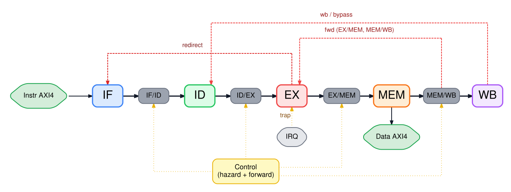

The five pipeline registers — IF/ID, ID/EX, EX/MEM, MEM/WB — carry decoded instruction state across stages. Each register has an `en` enable and a `flush` (clear-to-NOP) control driven by `kronos_hazard`. Operand forwarding is handled by `kronos_forward`, which selects between the register-file read value, the EX/MEM result, and the MEM/WB result.

---

## 2. IF Stage — Fetch, Alignment, Decompression, Branch Prediction

### 2a. Fetch FSM

The fetch FSM has two states: **FETCH_IDLE** and **FETCH_WAIT_R**.

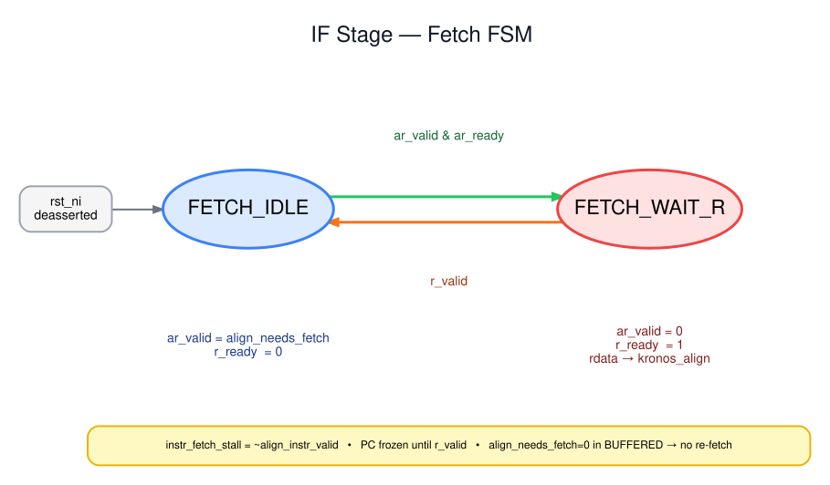

In FETCH_IDLE the FSM asserts `arvalid` when a new fetch is needed (`align_needs_fetch` is high). It transitions to FETCH_WAIT_R on the same cycle that `arready` is seen, then waits for `rvalid`. When `rvalid` arrives, the 32-bit word is handed to the alignment unit and the FSM returns to FETCH_IDLE, immediately issuing the next fetch if `align_needs_fetch` is still asserted.

`align_needs_fetch` gates every new AXI4 AR transaction. The alignment unit raises it when it has consumed its current word and needs the next one. For spanning instructions (a 16-bit compressed instruction whose upper half sits at the start of the next aligned word), the fetch FSM computes the next-word address by incrementing the current aligned PC by 4 (`NEED_UPPER` path).

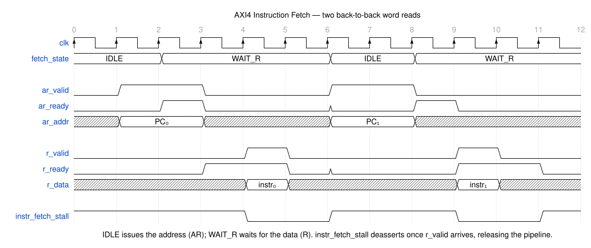

### 2b. Alignment Unit

RV32C instructions are 16 bits wide; RV32I instructions are 32 bits wide. Both arrive from memory as 32-bit aligned words, so the alignment unit must extract instructions of varying width from a fixed-width stream.

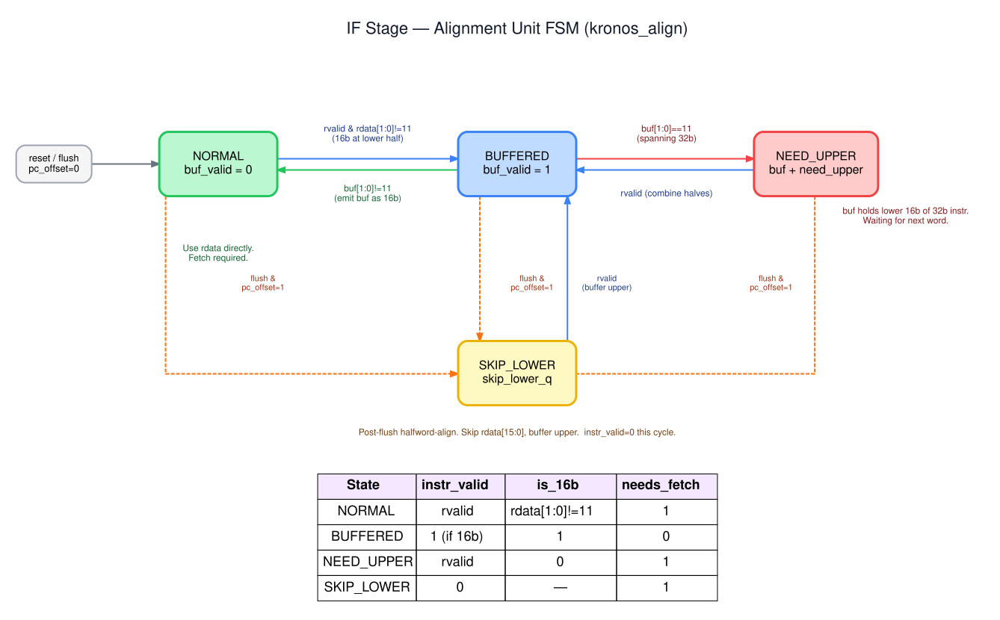

The alignment unit operates as a three-state FSM:

- **NORMAL** — the upper 16 bits of the fetched word have not yet been consumed. The current instruction is taken directly from the word. If it is 16-bit, the unit stays in NORMAL (or moves to BUFFERED for the upper half); if it is 32-bit spanning two aligned words, it transitions to NEED_UPPER.
- **BUFFERED** — the lower 16 bits of the previous word held a 16-bit instruction that was emitted. The upper 16 bits (`skip_lower_q`) are now at the head of the stream and may form the start of the next instruction.
- **NEED_UPPER** — the lower 16 bits of the current word hold the start of a 32-bit instruction whose upper 16 bits are in the next word. A new fetch is issued immediately; once `rvalid` arrives, the two halves are concatenated and emitted together.

`skip_lower_q` latches the upper half-word whenever a 16-bit instruction is extracted from the lower half of a fetched word, so the next decode sees the buffered upper half without issuing a new fetch.

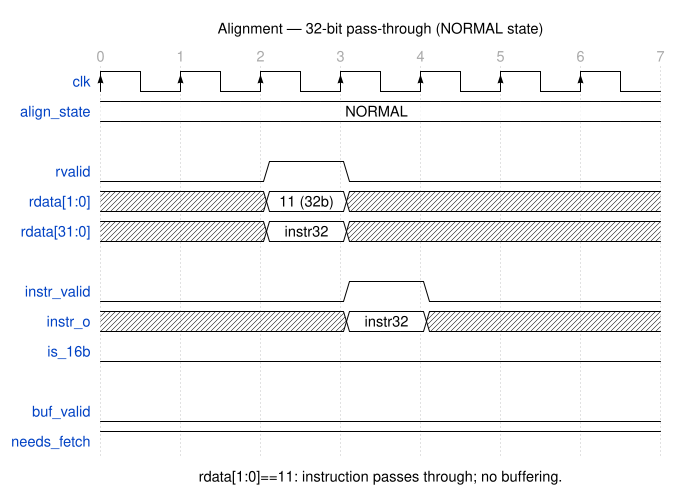

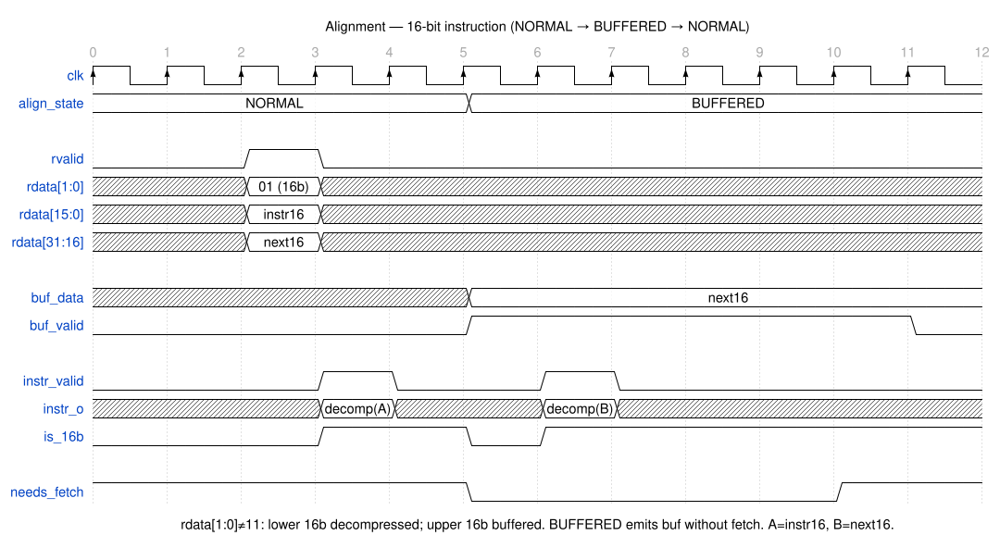

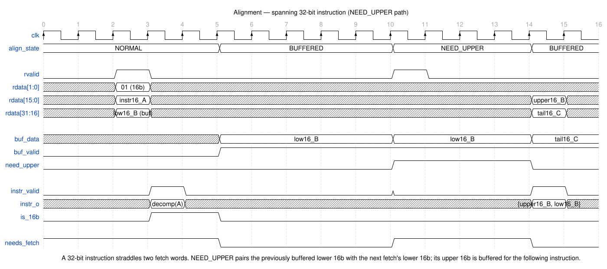

### 2c. Decompression

Decompression is purely combinational. Three instances of the decompressor module sit inside the alignment unit, one for each possible 16-bit half-word position. Each instance checks `inst[1:0]`: if both bits are `1`, the input is already 32-bit and is passed through unchanged; otherwise the 16-bit encoding is expanded to its canonical 32-bit RV32I equivalent before being forwarded to the ID stage. Reserved or undefined compressed encodings set `illegal_o`, which propagates through the pipeline and triggers a trap in EX.

### 2d. Branch Predictor

The branch predictor combines a **bimodal pattern history table (PHT)** with a **branch target buffer (BTB)**.

- **PHT:** 64 entries indexed by `PC[7:2]`, each holding a 2-bit saturating counter (00 = strongly not-taken, 11 = strongly taken).
- **BTB:** 16 entries indexed by `PC[5:2]`, each holding a valid bit and a 32-bit target address. Direct-mapped; no tag, so aliasing is possible.

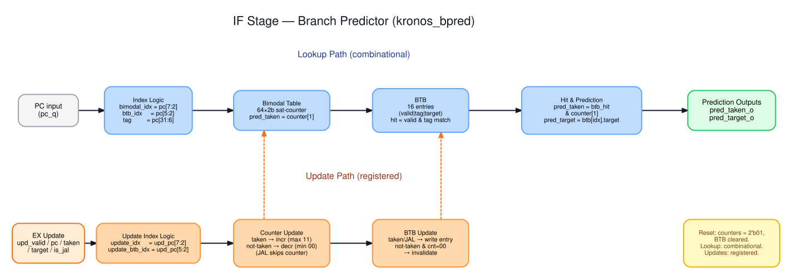

**Lookup (combinational):** On every cycle the current PC indexes both structures simultaneously. If the BTB entry is valid and the PHT counter MSB is `1`, the predictor asserts `pred_taken` and drives `pred_target` from the BTB. The IF stage uses `pred_target` as the next PC instead of `PC+2/4`.

**Update (registered):** The EX stage sends the resolved direction and target back to the predictor. The PHT counter is incremented on taken, decremented on not-taken, saturating at the extremes. On a taken outcome the BTB is written with the resolved target. On a not-taken outcome where the counter has saturated to `00`, the BTB entry is invalidated.

**Misprediction detection:** EX compares its resolved outcome against the prediction carried in the pipeline register. A misprediction is flagged when the direction disagrees (predicted taken but not-taken, or vice versa), or when both sides agree the branch was taken but the predicted target differs from the resolved target. Either condition triggers a two-cycle flush of IF and ID and a PC redirect.

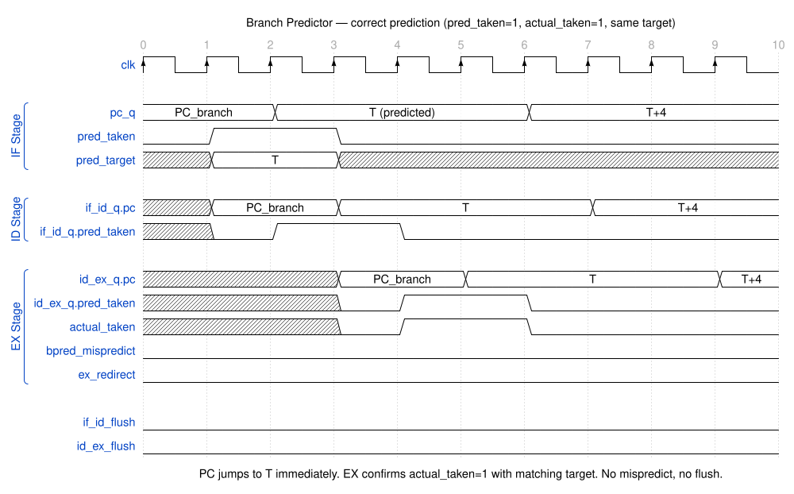

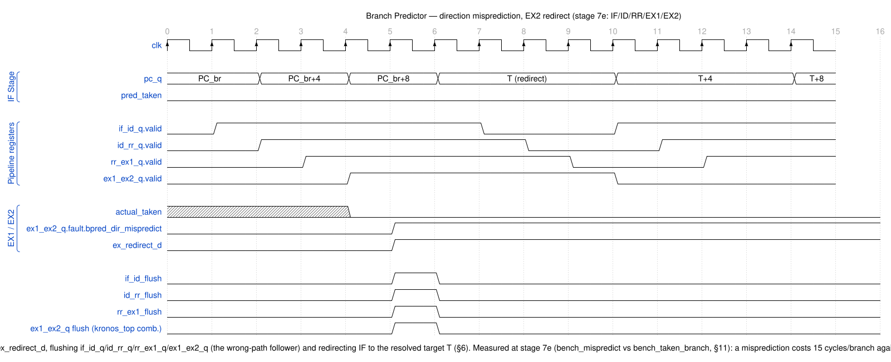

---

## 3. ID Stage — Decode and Register Read

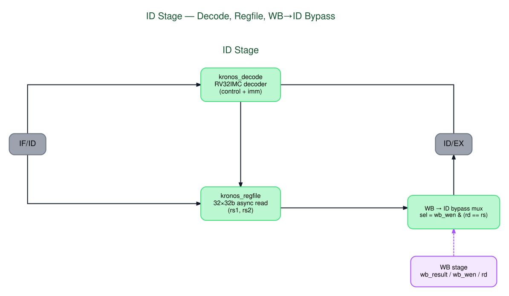

`kronos_decode` is a purely combinational decoder. It accepts a 32-bit instruction word (already decompressed) and produces the `decoded_instr_t` struct carried by all downstream pipeline registers. It handles the full RV32I base instruction set plus the M-extension multiply/divide opcodes (`OP` with `funct7=7'b0000_001`).

`kronos_regfile` implements 32 registers of 64 bits each. Reads are asynchronous (combinational): `rs1_rdata_o` and `rs2_rdata_o` reflect the current register contents in the same cycle the addresses are presented. Writes are synchronous on the rising clock edge. Reads and writes to `x0` are both suppressed — reads return `'0`, writes are ignored. The upper 32 bits of each entry are reserved for future RV64 support; the current pipeline only reads and writes the lower 32 bits.

A WB→ID bypass mux sits between the register file read ports and the ID/EX pipeline register. When the WB stage is writing a register that ID is simultaneously reading, the bypass mux selects the write-data path rather than the stale register file output. This is a same-cycle read-after-write path, distinct from the EX-stage forwarding paths; it handles the case where the WB result is not yet visible in the register file array.

---

## 4. EX Stage — Execute, Branch Resolution, Muldiv

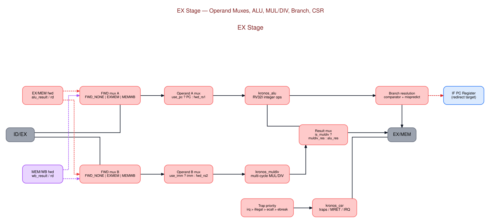

**Forwarding muxes.** Two muxes, one for each source operand (RS1, RS2), select among three sources controlled by `fwd_rs1_sel` / `fwd_rs2_sel` from `kronos_forward`:

| Select | Source |
|--------|--------|
| `FWD_NONE` | ID/EX register value (from register file or WB→ID bypass) |
| `FWD_EXMEM` | EX/MEM `alu_result` (instruction two stages ahead of the consumer) |
| `FWD_MEMWB` | MEM/WB `wb_result` (instruction one stage ahead of the consumer) |

`FWD_EXMEM` is suppressed when the producing instruction is a load — load data is not available until the MEM stage completes, which generates a load-use hazard instead. All forwarding is suppressed when `rd=x0`.

**ALU.** Single-cycle, fully combinational. Operations: ADD, SUB, SLL, SLT, SLTU, XOR, SRL, SRA, OR, AND, PASSB (used by LUI to pass the immediate through unchanged). The A-operand mux selects between the forwarded RS1 value and the instruction PC (for AUIPC and branch offset computation). The B-operand mux selects between the forwarded RS2 value and the sign-extended immediate.

**Muldiv.** `kronos_muldiv` implements all eight M-extension operations. MUL operations require **2 cycles** (one cycle of setup plus one result cycle). DIV and REM operations require **34 cycles** in the normal case (32 iterations of a restoring divider plus two bookkeeping cycles). Two edge cases — division by zero and `INT_MIN / -1` — are detected early and produce a result in **2 cycles**. While `muldiv_stall` is asserted the entire pipeline freezes.

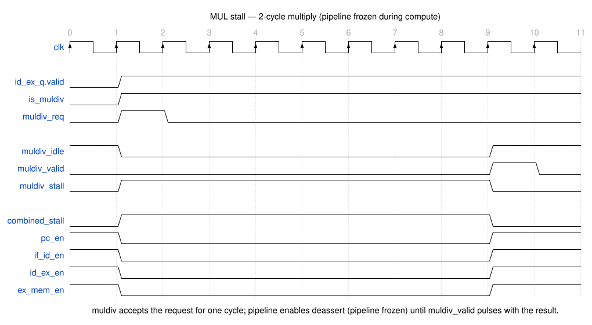

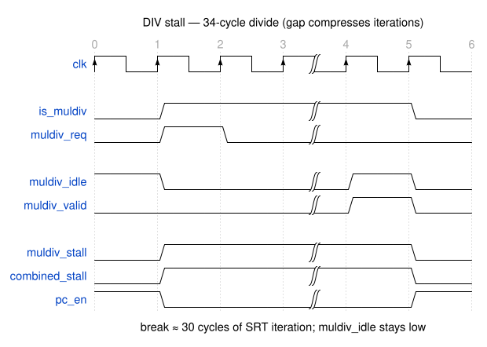

**Branch resolution.** EX evaluates every branch condition using the forwarded operands. JAL, JALR, and taken branches write `pc_next` into EX/MEM and assert `redirect`. JALR adds RS1 to the sign-extended 12-bit immediate and clears bit 0. The branch predictor update signals (resolved direction and target) are also driven from EX.

**Trap cause priority.** When multiple exception sources are simultaneously active, EX selects the cause in this order (highest first): external interrupt (`irq_pending`) > illegal instruction > ECALL > EBREAK. All traps and MRET assert `redirect` and set `pc_next` to the trap vector or `mepc` respectively.

**CSR unit.** `kronos_csr` implements CSRRW, CSRRS, and CSRRC plus their immediate variants (CSRRWI, CSRRSI, CSRRCI). CSR reads return the old value; writes take effect one cycle later. MISA is hardwired to report the I, M, and C extensions. Trap entry and MRET are gated by `~combined_stall` so that CSR state is only updated when the pipeline is not frozen.

---

## 5. MEM Stage — AXI4 Load/Store Unit

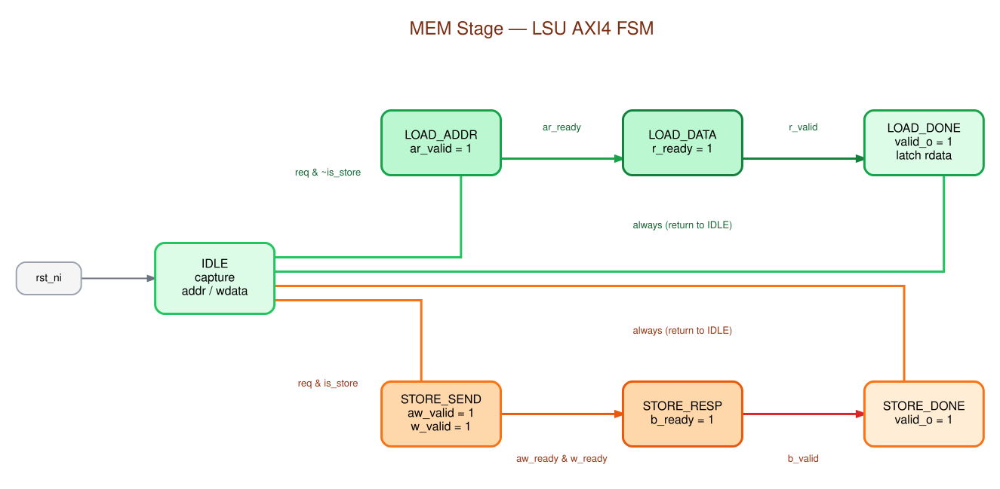

The LSU is a seven-state FSM that drives the AXI4 data channel. All loads and stores go through it; non-memory instructions pass through in one cycle with `mem_stall_o` deasserted.

**Load path:** `IDLE → LOAD_ADDR → LOAD_DATA → LOAD_DONE`

The FSM asserts `arvalid` in LOAD_ADDR and waits for `arready`. It then waits for `rvalid` in LOAD_DATA. On `rvalid`, the returned data is sign- or zero-extended according to `funct3` and latched into `lsu_rdata_latch`. The FSM moves to LOAD_DONE and drops `mem_stall_o` for one cycle to let the pipeline advance.

**Store path:** `IDLE → STORE_SEND → STORE_RESP → STORE_DONE`

In STORE_SEND the FSM asserts both `awvalid` and `wvalid` simultaneously. Because either channel may be accepted independently, two flags — `aw_acked_q` and `w_acked_q` — track which handshakes have completed. The FSM remains in STORE_SEND until both are acknowledged. It then moves to STORE_RESP and waits for `bvalid`, consuming the write response. STORE_DONE releases `mem_stall_o`.

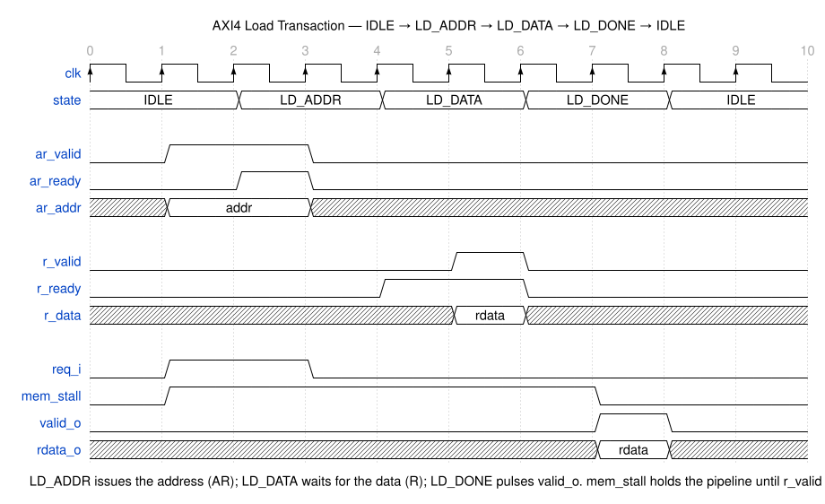

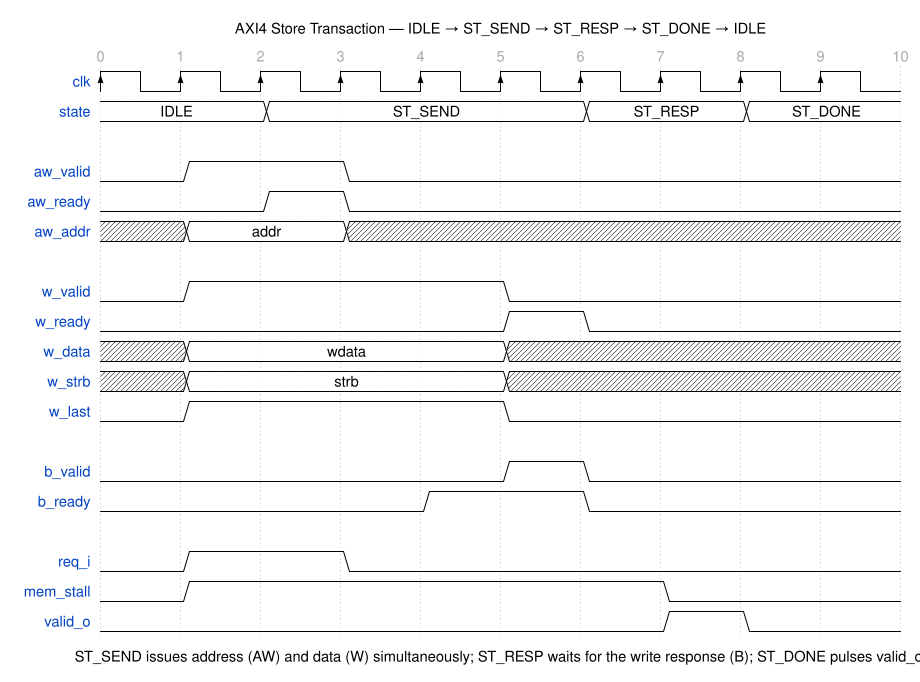

**`mem_done_q` latch.** When the pipeline is stalled by an instruction fetch (`instr_fetch_stall`) at the same cycle that the LSU would otherwise complete, the LSU cannot advance to LOAD_DONE/STORE_DONE and drop `mem_stall_o` — doing so would re-enter the idle state and potentially re-issue the same transaction. Instead, `mem_done_q` latches the completion event. On the cycle `instr_fetch_stall` clears, `mem_done_q` drives `mem_stall_o` low for one cycle to advance the pipeline. `lsu_rdata_latch` holds the load data stable across this window.

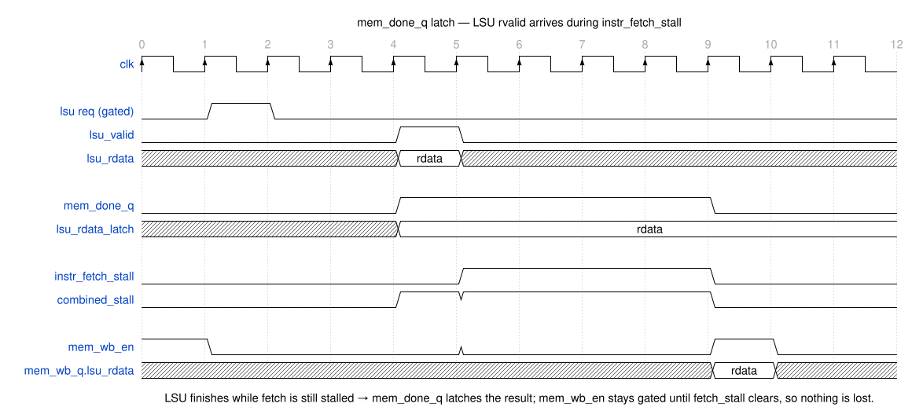

---

## 6. WB Stage — Writeback

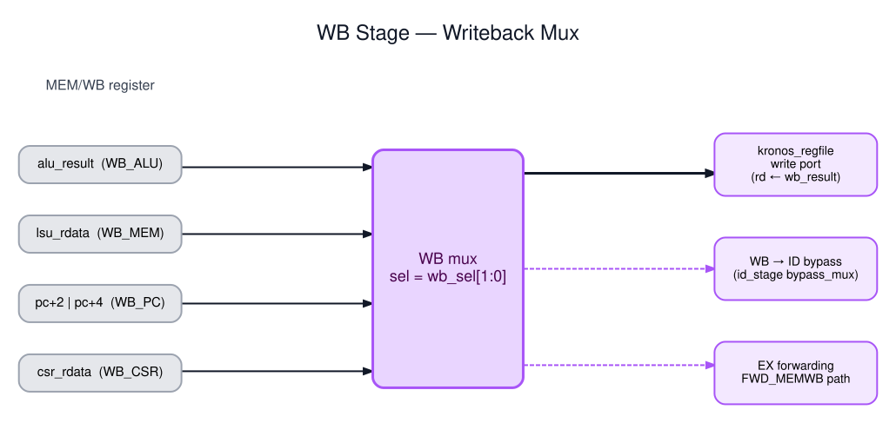

The writeback mux selects the value written to the register file based on `wb_sel` from the decoded instruction:

| `wb_sel` | Source | Used by |
|----------|--------|---------|
| `WB_ALU` | `alu_result` from EX/MEM | ALU, muldiv, AUIPC, LUI |
| `WB_MEM` | `lsu_rdata` from LSU | Load instructions |
| `WB_PC4` | `pc + 4` from EX/MEM | JAL, JALR (link address) |
| `WB_CSR` | `csr_rdata` from EX/MEM | CSR read-modify-write instructions |

The selected value is written to the register file when `rd_wen` is asserted and `rd != x0`. It is also driven to the WB→ID bypass mux and exposed as `FWD_MEMWB` to the EX forwarding muxes so that instructions in EX can consume the result without waiting for the register file write to settle.

---

## 7. Hazard and Forwarding Control

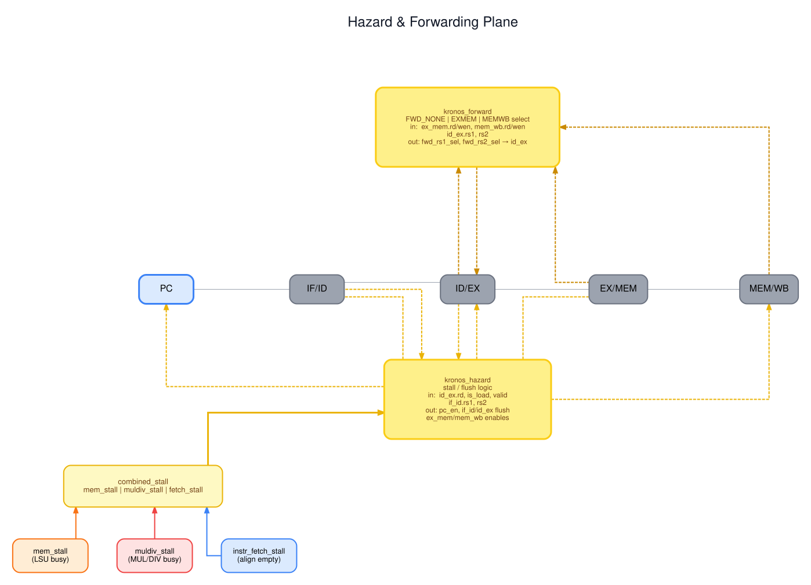

Two modules sit outside the pipeline stages and control all pipeline flow:

**`kronos_forward`** computes `fwd_rs1_sel` and `fwd_rs2_sel` combinationally from the instruction addresses in EX, MEM, and WB. Priority: EX/MEM result is preferred over MEM/WB result when both would forward to the same operand. `FWD_EXMEM` is suppressed for loads; all forwarding is suppressed for `rd=x0`.

**`kronos_hazard`** drives the `en` and `flush` control inputs to all five pipeline registers. It implements a strict priority ordering:

```
combined_stall = mem_stall | muldiv_stall | instr_fetch_stall
```

| Priority | Condition | Effect |
|----------|-----------|--------|
| 1 (highest) | `combined_stall` | Freeze entire pipeline (all `en=0`, no flushes) |
| 2 | Load-use hazard | Stall IF, ID, EX; insert bubble into EX/MEM |
| 3 | Misprediction / trap / MRET | Flush IF/ID and ID/EX; redirect PC |
| 4 (lowest) | None | Normal advance (all `en=1`, no flushes) |

**Load-use detection.** A load-use hazard exists when the instruction currently in EX is a valid load (`id_ex_valid & id_ex_is_load`), its destination is not `x0` (`id_ex_rd != 0`), and the instruction currently in ID reads the same register as either RS1 (`rs1_used & id_ex_rd == if_id_rs1`) or RS2 (`rs2_used & id_ex_rd == if_id_rs2`). The hazard inserts one bubble: IF and ID are held, the ID/EX register is flushed to NOP, and EX/MEM advances normally.

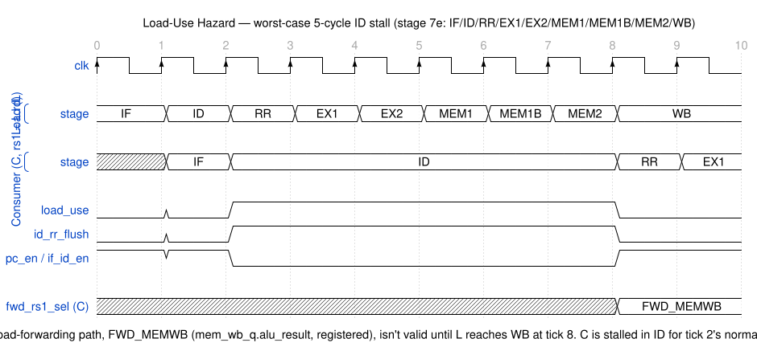

---

## 8. Timing Table and CSR Register Map

### Timing Table

| Instruction class | Cycles |
|---|:---:|
| ALU / logic / not-taken branch (predicted correctly) | 1 |
| Taken branch / JAL / JALR (predicted correctly) | 1 |
| Mispredicted branch / JAL / JALR | 3 |
| Load-use (load then dependent) | 3 |
| Load (AXI4) | 3 |
| Store (AXI4) | 3 |
| ECALL / EBREAK / illegal / MRET / interrupt | 3 |
| MUL / MULH / MULHSU / MULHU | 2 |
| DIV / REM (normal, 32 iterations) | 34 |
| DIV / REM (div-by-0 or INT_MIN / -1) | 2 |

Cycles are measured from the instruction entering EX to its result being available in WB (for most cases) or to the first valid instruction after a redirect (for branches and traps).

### CSR Register Map

| Address | Name | Description |
|---------|------|-------------|
| `0x300` | MSTATUS | MIE (bit 3): global interrupt enable. MPIE (bit 7): saved MIE on trap entry. |
| `0x301` | MISA | ISA. Bits [25:0] report I + M + C extensions. |
| `0x304` | MIE | Interrupt enable mask. MTIE (bit 7) enables the machine timer interrupt. |
| `0x305` | MTVEC | Trap vector base address. Direct mode (`[1:0] = 2'b00`). |
| `0x340` | MSCRATCH | Scratch register for M-mode software. |
| `0x341` | MEPC | PC of the trapping instruction; restored by MRET. |
| `0x342` | MCAUSE | Trap cause. Bit 31 = 1 for interrupts, 0 for exceptions. |
| `0x344` | MIP | Interrupt pending (read-only). MTIP (bit 7). |

### MCAUSE Codes

| Code | Cause |
|------|-------|
| `0x00000002` | Illegal instruction |
| `0x00000003` | EBREAK |
| `0x0000000B` | ECALL from M-mode |
| `0x80000007` | Machine timer interrupt |
